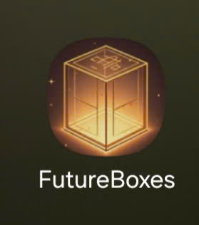
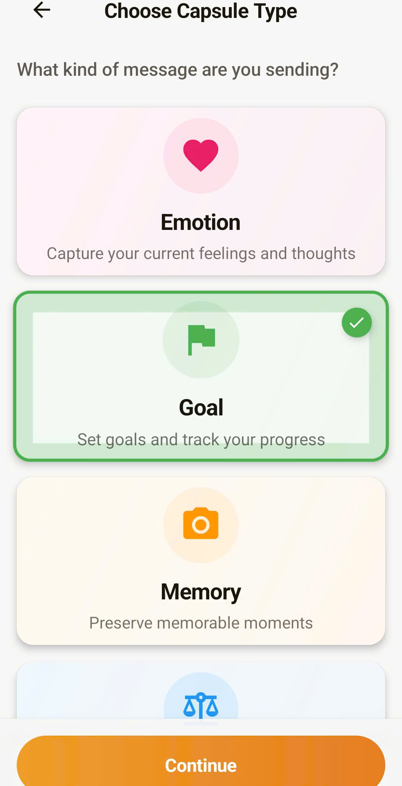
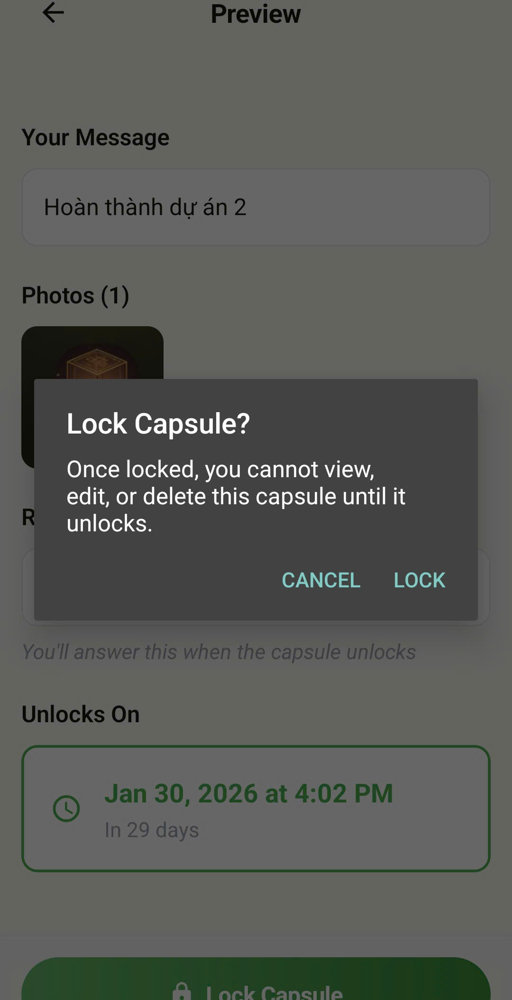
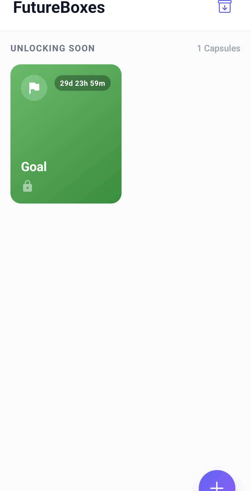
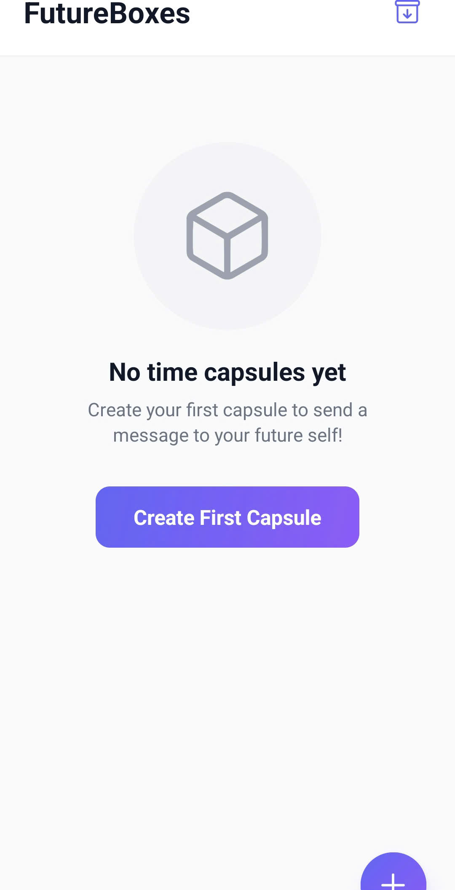
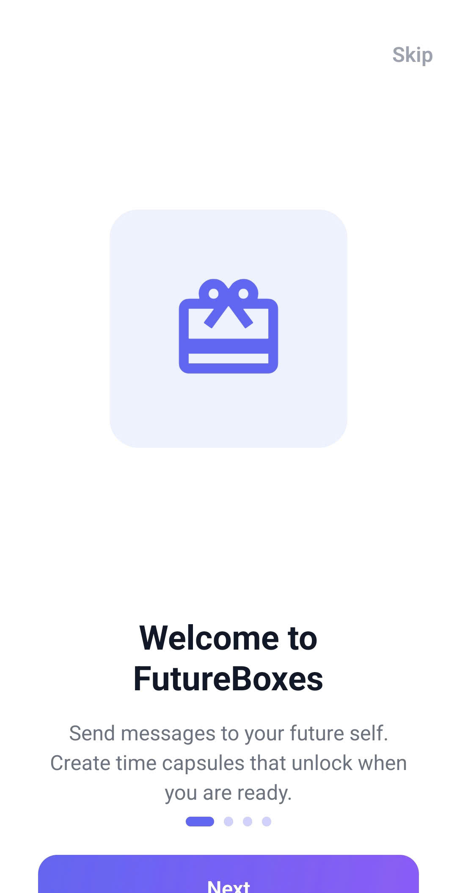
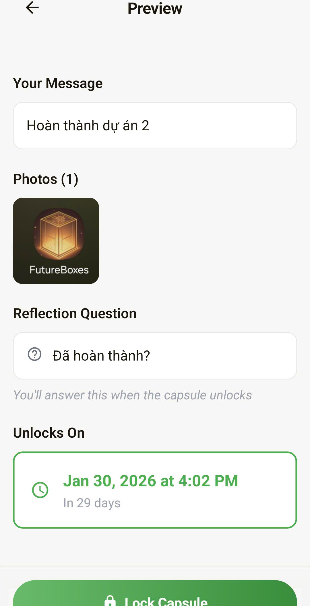

# FutureBoxes - Ứng Dụng Hộp Thời Gian (Time Capsule)

## 1. Giới thiệu chung

**FutureBoxes** là ứng dụng di động độc đáo cho phép người dùng tạo ra các "hộp thời gian" (time capsules) kỹ thuật số. Người dùng có thể lưu trữ những suy nghĩ, cảm xúc, mục tiêu, kỷ niệm và các quyết định quan trọng vào trong các chiếc hộp này, sau đó khóa lại và chỉ mở ra khi đến một thời điểm xác định trong tương lai.

Ứng dụng giúp người dùng kết nối với bản thân ở hiện tại và tương lai, đánh giá sự phát triển cá nhân, và trân trọng những khoảnh khắc đáng nhớ.

## 2. Tính năng nổi bật

### 📦 Đa dạng loại Capsule
Người dùng có thể chọn một trong 4 loại capsule phù hợp với nhu cầu:
*   **Emotion (Cảm xúc):** Ghi lại tâm trạng và suy nghĩ hiện tại.
*   **Goal (Mục tiêu):** Đặt ra mục tiêu để phấn đấu và nhìn lại.
*   **Memory (Kỷ niệm):** Lưu giữ những khoảnh khắc đẹp qua hình ảnh và lời nhắn.
*   **Decision (Quyết định):** Ghi lại các quyết định quan trọng để đánh giá độ đúng đắn sau này.

### 🔒 Cơ chế Khóa & Đếm ngược
*   Sau khi tạo, capsule sẽ bị **khóa hoàn toàn**. Người dùng không thể xem, sửa hoặc xóa nội dung bên trong.
*   Đồng hồ đếm ngược sẽ hiển thị thời gian còn lại cho đến ngày mở hộp, tạo cảm giác hồi hộp và mong chờ.

### 🔔 Thông báo & Mở hộp
*   Khi đến thời gian đã hẹn, ứng dụng sẽ gửi thông báo nhắc nhở người dùng.
*   Khi mở hộp, người dùng có thể xem lại toàn bộ nội dung text và hình ảnh đã lưu.
*   Đối với các loại Emotion, Goal và Decision, người dùng sẽ có phần **Reflection (Chiêm nghiệm)** để đánh giá lại những gì mình đã viết (Yes/No hoặc chấm điểm).

### 📂 Lưu trữ cục bộ & Riêng tư
*   Dữ liệu được lưu trữ trực tiếp trên thiết bị (Offline-first) đảm bảo tính riêng tư.
*   Lịch sử (Archive) giúp xem lại tất cả các capsule đã mở.

## 3. Quy trình phát triển (Development Process)

Dự án được phát triển dựa trên mô hình **thác nước rút gọn (Waterflow-like)** kết hợp với sức mạnh của AI Agents, như được mô tả trong tài liệu kỹ thuật của dự án.

### Các giai đoạn chính:
1.  **Requirement (Phân tích yêu cầu - Agent BA):** Xây dựng Product Requirements Document (PRD) chi tiết, xác định user stories và tiêu chí chấp nhận.
2.  **Design (Thiết kế - Agent UI/UX):**
    *   Thiết kế cơ sở dữ liệu (Schema) và luồng nghiệp vụ (Activity Diagrams).
    *   Mô tả chi tiết giao diện màn hình (Screen Descriptions).
3.  **Implementation (Triển khai - Agent React):** Code ứng dụng sử dụng React Native và Expo, tuân thủ nghiêm ngặt các bản thiết kế.
4.  **Test (Kiểm thử):** Đảm bảo chất lượng trước khi bàn giao.

## 4. Công nghệ sử dụng (Tech Stack)

*   **Framework:** React Native (New Architecture), Expo SDK 52
*   **Language:** TypeScript
*   **Storage:** SQLite (Local Database), File System (Image storage)
*   **Styling:** Custom Design System
*   **Animation:** Reanimated, Lottie

## 5. Thư viện hình ảnh ứng dụng

Dưới đây là một số hình ảnh minh họa về giao diện và trải nghiệm người dùng của FutureBoxes:

| | |
|:---:|:---:|
  |
|  |  |

