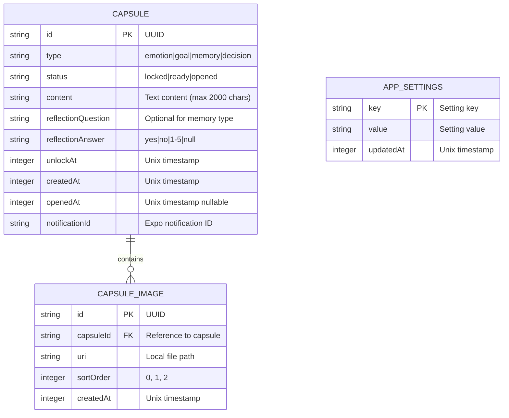

# Database Schema Design
# FutureBoxes - Time Capsule App

**Version:** 1.0
**Last Updated:** 2025-12-25
**Database:** SQLite (expo-sqlite)

---

## 1. Entity-Relationship Diagram



---

## 2. Table Schemas

### 2.1 CAPSULE

Luu tru thong tin chinh cua moi capsule.

| Column | Type | Constraints | Description |
|--------|------|-------------|-------------|
| `id` | TEXT | PRIMARY KEY | UUID v4, generated khi tao |
| `type` | TEXT | NOT NULL, CHECK | Loai capsule: 'emotion', 'goal', 'memory', 'decision' |
| `status` | TEXT | NOT NULL, DEFAULT 'locked' | Trang thai: 'locked', 'ready', 'opened' |
| `content` | TEXT | NOT NULL | Noi dung text (max 2000 ky tu) |
| `reflectionQuestion` | TEXT | NULL | Cau hoi reflection (NULL cho Memory type) |
| `reflectionAnswer` | TEXT | NULL | Cau tra loi: 'yes'/'no' hoac '1'-'5' |
| `unlockAt` | INTEGER | NOT NULL | Unix timestamp thoi diem mo |
| `createdAt` | INTEGER | NOT NULL, DEFAULT | Unix timestamp thoi diem tao |
| `openedAt` | INTEGER | NULL | Unix timestamp thoi diem thuc su mo |
| `notificationId` | TEXT | NULL | ID cua scheduled notification |

**SQL CREATE:**

```sql
CREATE TABLE IF NOT EXISTS capsule (
    id TEXT PRIMARY KEY,
    type TEXT NOT NULL CHECK (type IN ('emotion', 'goal', 'memory', 'decision')),
    status TEXT NOT NULL DEFAULT 'locked' CHECK (status IN ('locked', 'ready', 'opened')),
    content TEXT NOT NULL,
    reflectionQuestion TEXT,
    reflectionAnswer TEXT,
    unlockAt INTEGER NOT NULL,
    createdAt INTEGER NOT NULL DEFAULT (strftime('%s', 'now')),
    openedAt INTEGER,
    notificationId TEXT
);
```

**Validation Rules:**
- `content`: Length 1-2000 characters
- `reflectionQuestion`: Required khi type IN ('emotion', 'goal', 'decision'), NULL khi type = 'memory'
- `reflectionAnswer`:
  - NULL khi status != 'opened'
  - 'yes' hoac 'no' khi type IN ('emotion', 'goal')
  - '1', '2', '3', '4', '5' khi type = 'decision'
  - NULL khi type = 'memory'
- `unlockAt`: Phai > createdAt (thoi gian tuong lai)

---

### 2.2 CAPSULE_IMAGE

Luu tru reference den anh cua capsule (max 3 anh/capsule).

| Column | Type | Constraints | Description |
|--------|------|-------------|-------------|
| `id` | TEXT | PRIMARY KEY | UUID v4 |
| `capsuleId` | TEXT | NOT NULL, FOREIGN KEY | Reference den capsule.id |
| `uri` | TEXT | NOT NULL | Duong dan file trong local storage |
| `sortOrder` | INTEGER | NOT NULL, DEFAULT 0 | Thu tu hien thi (0, 1, 2) |
| `createdAt` | INTEGER | NOT NULL, DEFAULT | Unix timestamp |

**SQL CREATE:**

```sql
CREATE TABLE IF NOT EXISTS capsule_image (
    id TEXT PRIMARY KEY,
    capsuleId TEXT NOT NULL,
    uri TEXT NOT NULL,
    sortOrder INTEGER NOT NULL DEFAULT 0,
    createdAt INTEGER NOT NULL DEFAULT (strftime('%s', 'now')),
    FOREIGN KEY (capsuleId) REFERENCES capsule(id) ON DELETE CASCADE
);
```

**Validation Rules:**
- `sortOrder`: 0, 1, hoac 2 (max 3 anh)
- Moi capsule chi duoc toi da 3 records trong bang nay

---

### 2.3 APP_SETTINGS

Key-value store cho app settings (co the dung AsyncStorage thay the).

| Column | Type | Constraints | Description |
|--------|------|-------------|-------------|
| `key` | TEXT | PRIMARY KEY | Ten setting |
| `value` | TEXT | NOT NULL | Gia tri setting |
| `updatedAt` | INTEGER | NOT NULL, DEFAULT | Unix timestamp |

**SQL CREATE:**

```sql
CREATE TABLE IF NOT EXISTS app_settings (
    key TEXT PRIMARY KEY,
    value TEXT NOT NULL,
    updatedAt INTEGER NOT NULL DEFAULT (strftime('%s', 'now'))
);
```

**Predefined Keys:**
| Key | Possible Values | Default | Description |
|-----|-----------------|---------|-------------|
| `onboardingCompleted` | 'true' / 'false' | 'false' | Da xem onboarding chua |
| `notificationPermission` | 'granted' / 'denied' / 'undetermined' | 'undetermined' | Trang thai permission |

---

## 3. Indexing Strategy

### 3.1 Primary Indexes (Automatic)
- `capsule.id` - PRIMARY KEY index
- `capsule_image.id` - PRIMARY KEY index
- `app_settings.key` - PRIMARY KEY index

### 3.2 Secondary Indexes

```sql
-- Index cho Home Screen query (6 capsules gan nhat, status locked/ready)
CREATE INDEX idx_capsule_status_unlock
ON capsule(status, unlockAt)
WHERE status IN ('locked', 'ready');

-- Index cho Archive query (capsules da mo, sort by openedAt)
CREATE INDEX idx_capsule_opened
ON capsule(openedAt DESC)
WHERE status = 'opened';

-- Index cho capsule images lookup
CREATE INDEX idx_capsule_image_capsuleid
ON capsule_image(capsuleId);
```

### 3.3 Index Usage by Feature

| Feature | Query Pattern | Index Used |
|---------|--------------|------------|
| F2: Home Screen | `WHERE status IN ('locked','ready') ORDER BY unlockAt LIMIT 6` | idx_capsule_status_unlock |
| F6: Timer Check | `WHERE status = 'locked' AND unlockAt <= ?` | idx_capsule_status_unlock |
| F8: Open Capsule | `WHERE id = ?` | PRIMARY KEY |
| F11: Archive | `WHERE status = 'opened' ORDER BY openedAt DESC` | idx_capsule_opened |
| Images Load | `WHERE capsuleId = ? ORDER BY sortOrder` | idx_capsule_image_capsuleid |

---

## 4. Common Queries

### 4.1 Home Screen - Get Upcoming Capsules

```sql
SELECT c.*,
       GROUP_CONCAT(ci.uri) as imageUris
FROM capsule c
LEFT JOIN capsule_image ci ON c.id = ci.capsuleId
WHERE c.status IN ('locked', 'ready')
GROUP BY c.id
ORDER BY c.unlockAt ASC
LIMIT 6;
```

### 4.2 Archive - Get Opened Capsules

```sql
SELECT c.*,
       GROUP_CONCAT(ci.uri) as imageUris
FROM capsule c
LEFT JOIN capsule_image ci ON c.id = ci.capsuleId
WHERE c.status = 'opened'
GROUP BY c.id
ORDER BY c.openedAt DESC;
```

### 4.3 Create Capsule

```sql
INSERT INTO capsule (id, type, status, content, reflectionQuestion, unlockAt, notificationId)
VALUES (?, ?, 'locked', ?, ?, ?, ?);
```

### 4.4 Add Image to Capsule

```sql
INSERT INTO capsule_image (id, capsuleId, uri, sortOrder)
VALUES (?, ?, ?, ?);
```

### 4.5 Update Capsule Status to Ready

```sql
UPDATE capsule
SET status = 'ready'
WHERE status = 'locked' AND unlockAt <= strftime('%s', 'now');
```

### 4.6 Open Capsule with Reflection

```sql
UPDATE capsule
SET status = 'opened',
    openedAt = strftime('%s', 'now'),
    reflectionAnswer = ?
WHERE id = ?;
```

### 4.7 Delete Opened Capsule

```sql
-- Images se tu dong xoa nho ON DELETE CASCADE
DELETE FROM capsule WHERE id = ? AND status = 'opened';
```

### 4.8 Count Capsules by Status

```sql
SELECT status, COUNT(*) as count
FROM capsule
GROUP BY status;
```

---

## 5. Data Migration Strategy

### 5.1 Initial Setup (v1.0)

```sql
-- Run on first app launch
PRAGMA foreign_keys = ON;

CREATE TABLE IF NOT EXISTS capsule (...);
CREATE TABLE IF NOT EXISTS capsule_image (...);
CREATE TABLE IF NOT EXISTS app_settings (...);

CREATE INDEX IF NOT EXISTS idx_capsule_status_unlock ...;
CREATE INDEX IF NOT EXISTS idx_capsule_opened ...;
CREATE INDEX IF NOT EXISTS idx_capsule_image_capsuleid ...;

-- Set schema version
INSERT OR REPLACE INTO app_settings (key, value, updatedAt)
VALUES ('schemaVersion', '1', strftime('%s', 'now'));
```

### 5.2 Future Migrations

Khi can thay doi schema trong tuong lai:

```typescript
const CURRENT_SCHEMA_VERSION = 1;

async function migrateIfNeeded(db: SQLiteDatabase) {
  const result = await db.getFirstAsync<{value: string}>(
    "SELECT value FROM app_settings WHERE key = 'schemaVersion'"
  );
  const currentVersion = result ? parseInt(result.value) : 0;

  if (currentVersion < CURRENT_SCHEMA_VERSION) {
    // Run migrations sequentially
    if (currentVersion < 1) await migrateToV1(db);
    // if (currentVersion < 2) await migrateToV2(db);

    // Update version
    await db.runAsync(
      "INSERT OR REPLACE INTO app_settings (key, value, updatedAt) VALUES ('schemaVersion', ?, strftime('%s', 'now'))",
      [CURRENT_SCHEMA_VERSION.toString()]
    );
  }
}
```

---

## 6. Image Storage Strategy

### 6.1 File System Structure

```
${FileSystem.documentDirectory}
└── capsule_images/
    ├── {capsuleId}/
    │   ├── 0.jpg
    │   ├── 1.jpg
    │   └── 2.jpg
    └── {capsuleId}/
        └── 0.jpg
```

### 6.2 Image Processing Flow

1. User chon anh tu gallery (expo-image-picker)
2. Copy anh vao `documentDirectory/capsule_images/{capsuleId}/`
3. Luu URI vao `capsule_image.uri`
4. Khi xoa capsule, xoa folder `capsule_images/{capsuleId}/`

### 6.3 URI Format trong Database

```
file:///data/user/0/com.app/files/capsule_images/{capsuleId}/0.jpg
```

---

## 7. Performance Considerations

### 7.1 Expected Data Volume

| Metric | Estimate | Impact |
|--------|----------|--------|
| Capsules per user | 10-100 | Low query load |
| Images per capsule | 0-3 | Moderate storage |
| Average content size | 500 chars | ~0.5KB per capsule |
| Image size (after resize) | ~200KB | ~600KB max per capsule |

### 7.2 Optimization Notes

1. **Lazy Loading Images**: Chi load anh khi can hien thi
2. **Pagination for Archive**: Neu user co nhieu capsules, implement infinite scroll
3. **Image Compression**: Resize anh truoc khi luu (max 1024px width)
4. **Status Check Debounce**: Chi check status moi 60 giay, khong realtime

---

## 8. Backup Considerations (Future)

Du khong co trong v1, design san cho tuong lai:

```sql
-- Export all data as JSON
SELECT json_group_array(
    json_object(
        'id', id,
        'type', type,
        'status', status,
        'content', content,
        'reflectionQuestion', reflectionQuestion,
        'reflectionAnswer', reflectionAnswer,
        'unlockAt', unlockAt,
        'createdAt', createdAt,
        'openedAt', openedAt
    )
) as capsules FROM capsule;
```

---

*Schema Design End*
