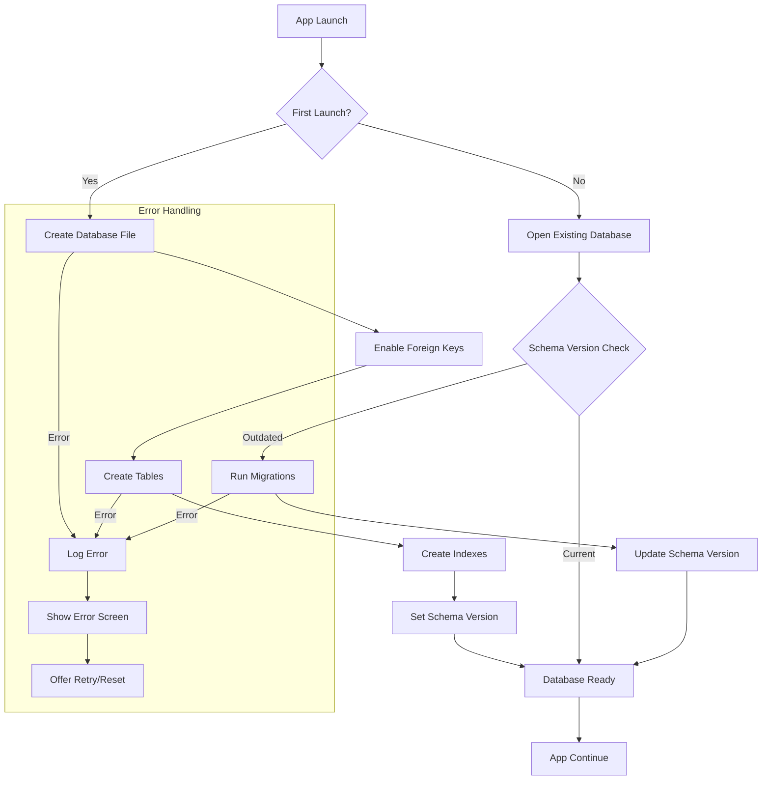
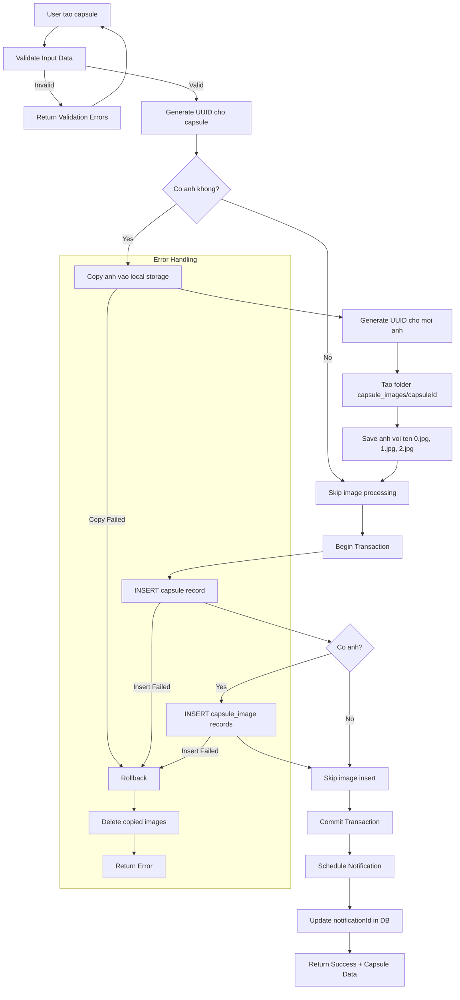
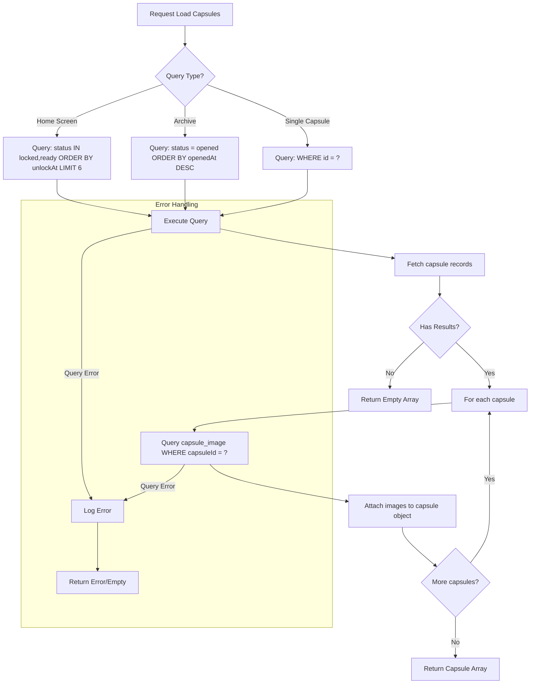
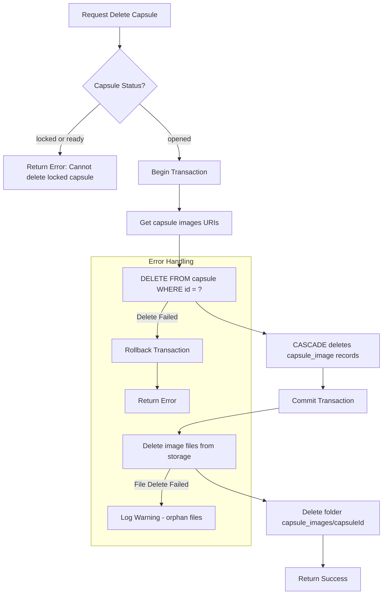
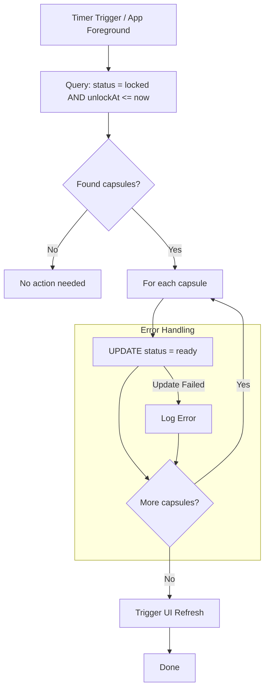

# F1: Local Data Storage - Activity Diagram

**Feature ID:** F1
**Priority:** Must Have
**Dependencies:** None

---

## 1. Overview

Feature nay la foundation cho toan bo app. Cung cap kha nang luu tru va truy xuat du lieu capsule tren local device su dung SQLite.

---

## 2. Activity Diagram - Database Initialization

---

## 3. Activity Diagram - Save Capsule Data

---

## 4. Activity Diagram - Load Capsule Data

---

## 5. Activity Diagram - Delete Capsule Data

---

## 6. Activity Diagram - Update Capsule Status

---

## 7. User Interaction Flow

### 7.1 Khi nao data duoc save?
- Sau khi user tap "Lock" va confirm tao capsule
- Reflection answer duoc save khi user tra loi

### 7.2 Khi nao data duoc load?
- App launch: Load home screen capsules
- Navigate to Archive: Load opened capsules
- Tap vao capsule: Load single capsule detail

### 7.3 Khi nao data duoc delete?
- Chi khi user xoa capsule da mo (status = opened)
- User confirm trong dialog truoc khi xoa

---

## 8. Offline Behavior

| Scenario | Behavior |
|----------|----------|
| No internet | App hoat dong binh thuong (100% offline) |
| Airplane mode | Tat ca features hoat dong |
| Low storage | Warning khi save anh, block neu khong du |

---

## 9. Data Persistence Guarantees

| Event | Data Status |
|-------|-------------|
| App restart | Data van con |
| Device restart | Data van con |
| App update | Data van con (migration if needed) |
| App uninstall | Data bi XOA |
| Clear app data | Data bi XOA |

---

## 10. Edge Cases

| Case | Handling |
|------|----------|
| Database corruption | Show error, offer reset option |
| Storage full | Block save, show warning |
| Invalid data in DB | Skip invalid records, log error |
| Concurrent access | SQLite handles via locking |
| Large content (2000 chars) | Accepted, no truncation |

---

*Flow End*
