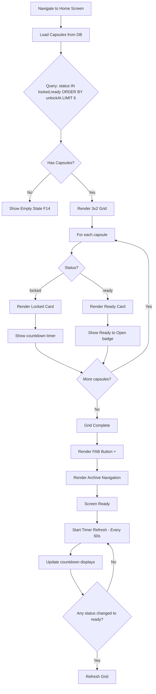
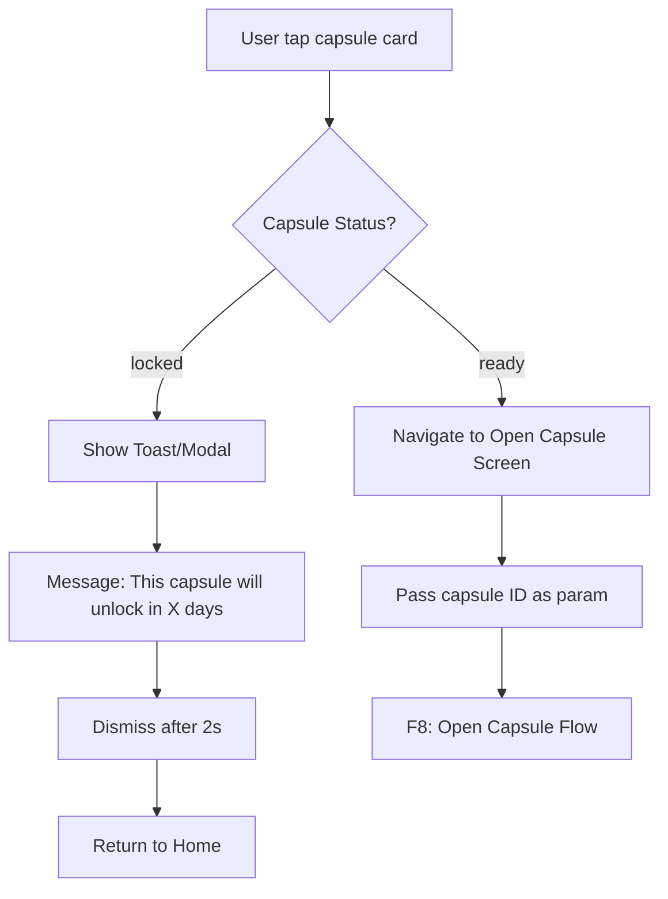
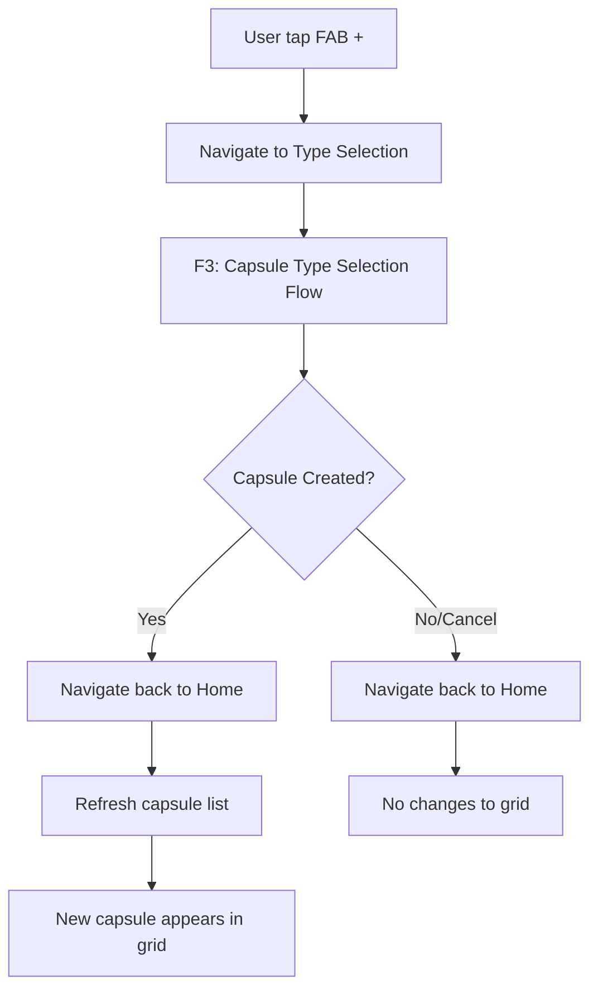
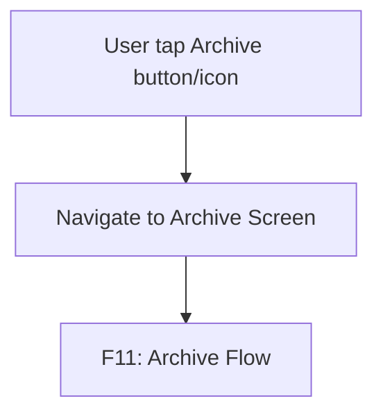
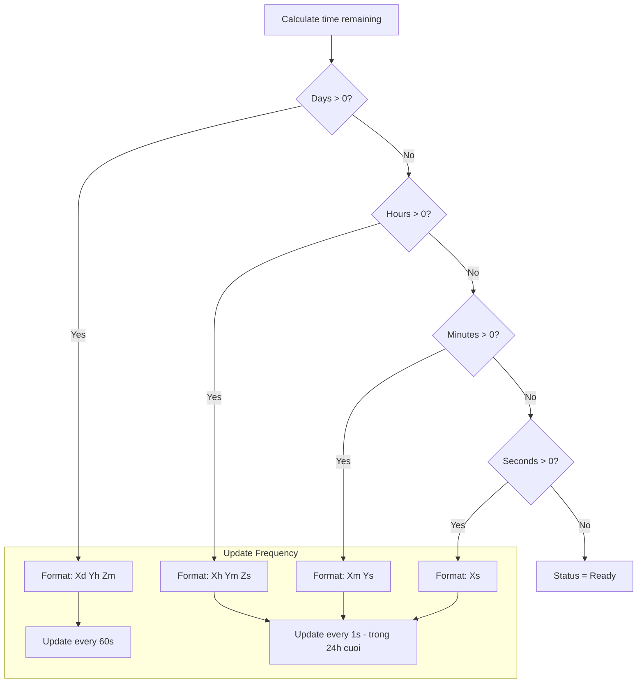

# F2: Home Screen - Activity Diagram

**Feature ID:** F2
**Priority:** Must Have
**Dependencies:** F1 (Local Data Storage)

---

## 1. Overview

Home Screen la man hinh chinh hien thi 6 capsules sap mo nhat trong layout 3x2 grid. User co the tap vao capsule de mo (neu ready) hoac xem thong bao chua den gio (neu locked).

---

## 2. Main Activity Diagram



---

## 3. User Interaction - Tap Capsule



---

## 4. User Interaction - Create New Capsule



---

## 5. User Interaction - Navigate to Archive



---

## 6. Capsule Card Display

### 6.1 Locked Capsule Card

```
+---------------------------+
|  [Capsule Type Icon]      |
|                           |
|     3d 5h 30m             |  <- Countdown
|                           |
|  [Lock Icon]              |  <- Visual lock indicator
+---------------------------+
```

### 6.2 Ready Capsule Card

```
+---------------------------+
|  [Capsule Type Icon]      |
|                           |
|   Ready to Open!          |  <- Ready badge
|                           |
|  [Unlock Icon/Glow]       |  <- Visual ready indicator
+---------------------------+
```

---

## 7. Countdown Timer Logic



---

## 8. Screen Layout

```
+----------------------------------------+
|  FutureBoxes                [Archive]  |  <- Header
+----------------------------------------+
|                                        |
|  +----------+  +----------+            |
|  | Capsule1 |  | Capsule2 |            |  <- Row 1
|  +----------+  +----------+            |
|                                        |
|  +----------+  +----------+            |
|  | Capsule3 |  | Capsule4 |            |  <- Row 2
|  +----------+  +----------+            |
|                                        |
|  +----------+  +----------+            |
|  | Capsule5 |  | Capsule6 |            |  <- Row 3
|  +----------+  +----------+            |
|                                        |
|                              [+]       |  <- FAB
+----------------------------------------+
```

---

## 9. Data Refresh Triggers

| Trigger | Action |
|---------|--------|
| Screen mount | Load capsules from DB |
| App foreground | Refresh list + check status updates |
| After create capsule | Refresh list |
| After open capsule | Refresh list (capsule removed) |
| Timer tick | Update countdown displays |
| Pull to refresh (optional) | Refresh list |

---

## 10. Edge Cases

| Case | Handling |
|------|----------|
| Exactly 6 capsules | Show all 6, no scroll |
| More than 6 capsules | Show top 6 (soonest unlock), rest hidden |
| Less than 6 capsules | Show available, fill grid with empty slots |
| 0 capsules | Show Empty State (F14) |
| Mix of locked and ready | Ready appear in chronological order with locked |
| All capsules are ready | All show Ready to Open badge |
| Capsule becomes ready while viewing | Update card from countdown to Ready badge |

---

## 11. Performance Considerations

| Aspect | Implementation |
|--------|----------------|
| Initial load | Single DB query, fast |
| Timer updates | Only update text, no re-render full card |
| Images | Lazy load card icons only |
| Memory | Max 6 items, minimal footprint |
| Animations | Subtle hover/press states only |

---

## 12. Accessibility

| Element | Accessibility |
|---------|---------------|
| Capsule card | Tappable, describe type and status |
| FAB | Label: "Create new capsule" |
| Archive | Label: "View opened capsules" |
| Countdown | Announce time remaining |

---

*Flow End*
