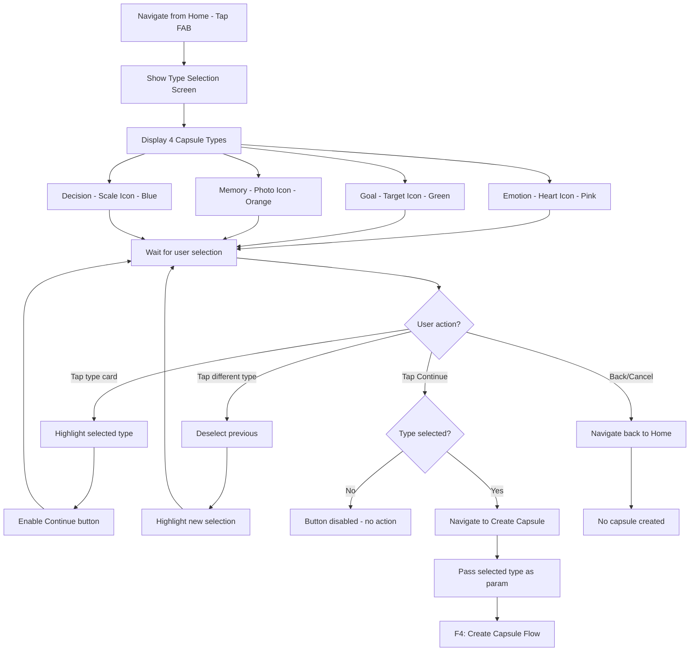
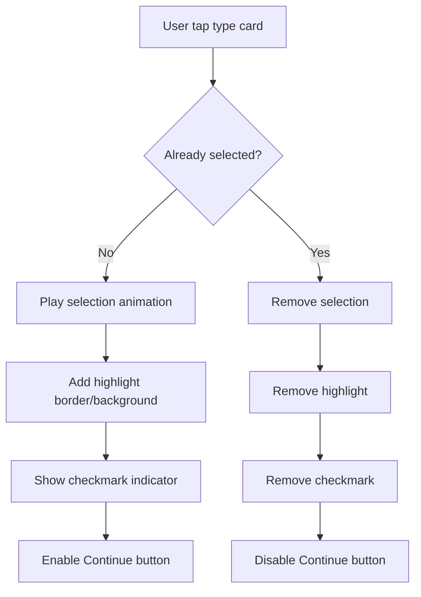
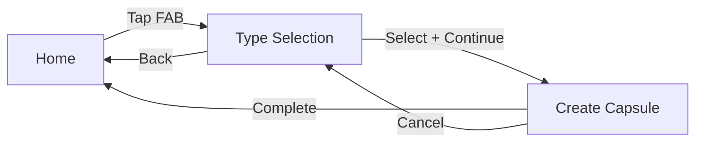

# F3: Capsule Type Selection - Activity Diagram

**Feature ID:** F3
**Priority:** Must Have
**Dependencies:** F1 (Local Data Storage)

---

## 1. Overview

Man hinh cho phep user chon 1 trong 4 loai capsule truoc khi tao. Moi loai co icon, mau sac va mo ta rieng de user hieu muc dich su dung.

---

## 2. Main Activity Diagram



---

## 3. Type Card Interaction



---

## 4. Screen Layout

```
+----------------------------------------+
|  <- Back          Choose Type          |  <- Header
+----------------------------------------+
|                                        |
|  What would you like to create?        |
|                                        |
|  +----------------------------------+  |
|  |  [Heart]  Emotion                |  |
|  |  Record your feelings and        |  |
|  |  thoughts for future reflection  |  |
|  +----------------------------------+  |
|                                        |
|  +----------------------------------+  |
|  |  [Target]  Goal                  |  |
|  |  Set a goal and check back       |  |
|  |  to see if you achieved it       |  |
|  +----------------------------------+  |
|                                        |
|  +----------------------------------+  |
|  |  [Photo]  Memory                 |  |
|  |  Preserve a special moment       |  |
|  |  to revisit in the future        |  |
|  +----------------------------------+  |
|                                        |
|  +----------------------------------+  |
|  |  [Scale]  Decision               |  |
|  |  Document an important decision  |  |
|  |  and rate it later               |  |
|  +----------------------------------+  |
|                                        |
|  +----------------------------------+  |
|  |          Continue                |  |  <- Disabled until selection
|  +----------------------------------+  |
|                                        |
+----------------------------------------+
```

---

## 5. Capsule Type Details

| Type | Icon | Color | Description | Has Reflection |
|------|------|-------|-------------|----------------|
| Emotion | Heart / Face emoji | Pink / Purple | Ghi lai cam xuc, suy nghi hien tai | Yes (Yes/No) |
| Goal | Target / Flag | Green / Blue | Dat muc tieu va theo doi ket qua | Yes (Yes/No) |
| Memory | Camera / Photo | Orange / Yellow | Luu giu khoanh khac dang nho | No |
| Decision | Scale / Crossroads | Blue / Gray | Ghi nhan quyet dinh quan trong | Yes (Rating 1-5) |

---

## 6. Selection States

### 6.1 Unselected State

```
+----------------------------------+
|  [Icon]  Type Name               |
|  Description text in gray...     |
+----------------------------------+
Border: Light gray
Background: White/Light
```

### 6.2 Selected State

```
+==================================+
|  [Icon]  Type Name          [v] |
|  Description text...            |
+==================================+
Border: Type's color (thick)
Background: Light tint of type's color
Checkmark: Visible in corner
```

---

## 7. Continue Button States

| State | Appearance | Action |
|-------|------------|--------|
| Disabled | Grayed out, muted | No action on tap |
| Enabled | Full color, prominent | Navigate to Create screen |

---

## 8. Navigation Flow



---

## 9. Animation Specifications

| Animation | Duration | Effect |
|-----------|----------|--------|
| Card tap | 150ms | Scale down slightly (0.98) |
| Selection highlight | 200ms | Border color fade in |
| Checkmark appear | 200ms | Fade in + scale up |
| Continue button enable | 150ms | Opacity 0.5 -> 1.0 |

---

## 10. Edge Cases

| Case | Handling |
|------|----------|
| Double tap same card | Toggle selection off |
| Tap Continue without selection | Button disabled, no action |
| Back while selected | Discard selection, return home |
| Rotate device | Maintain selection state |
| Low memory | Simple cards, no heavy graphics |

---

## 11. Accessibility

| Element | Accessibility |
|---------|---------------|
| Type card | Role: Button, Label: "[Type Name]: [Description]" |
| Selected card | State: Selected |
| Continue button | Role: Button, State: Disabled/Enabled |
| Back button | Label: "Go back to home" |

---

## 12. Haptic Feedback

| Action | Haptic |
|--------|--------|
| Select type | Light impact |
| Deselect type | None |
| Tap Continue (enabled) | Medium impact |
| Tap Continue (disabled) | None |

---

*Flow End*
