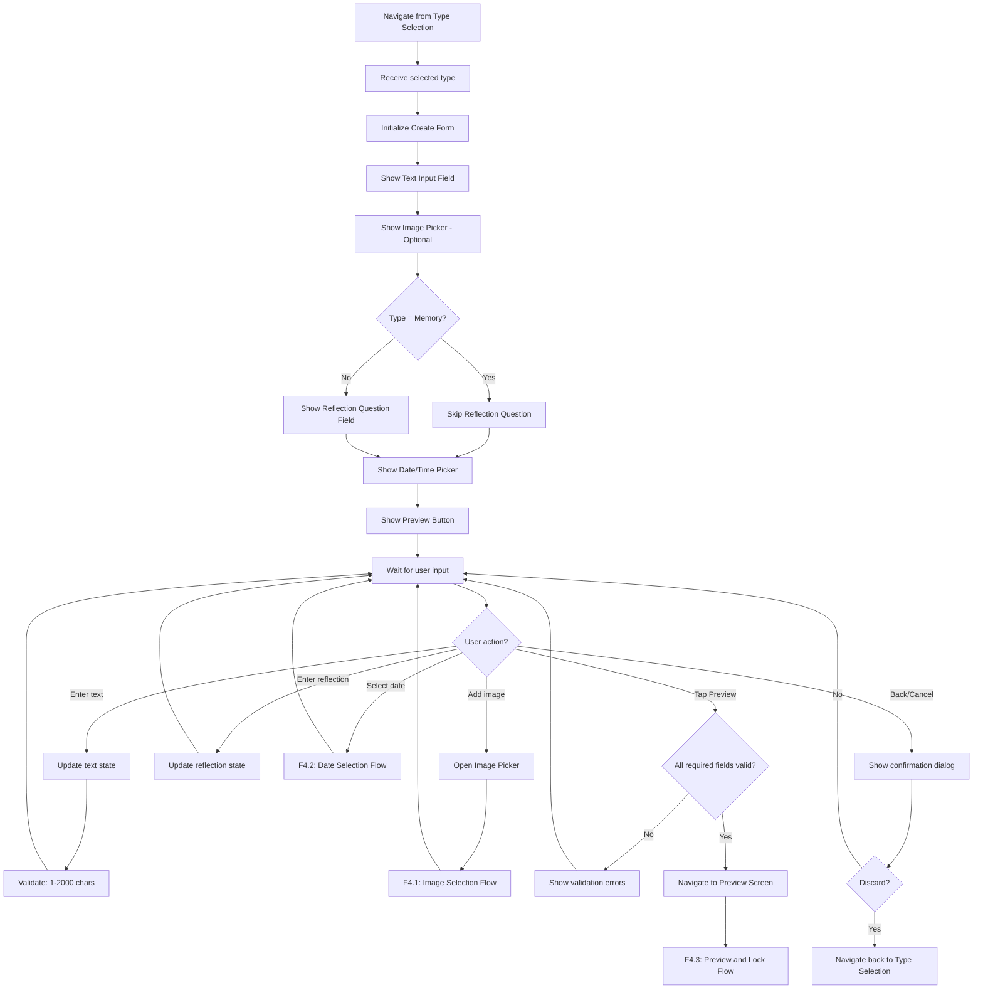
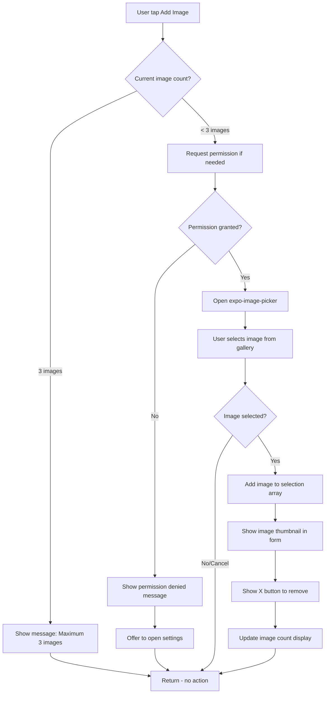
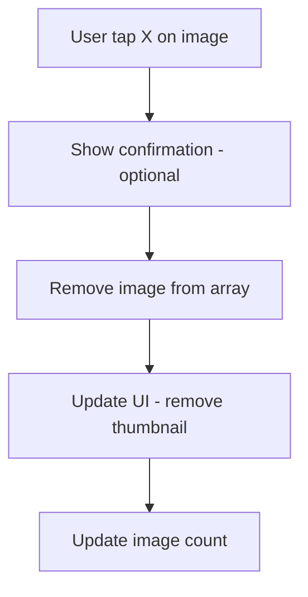
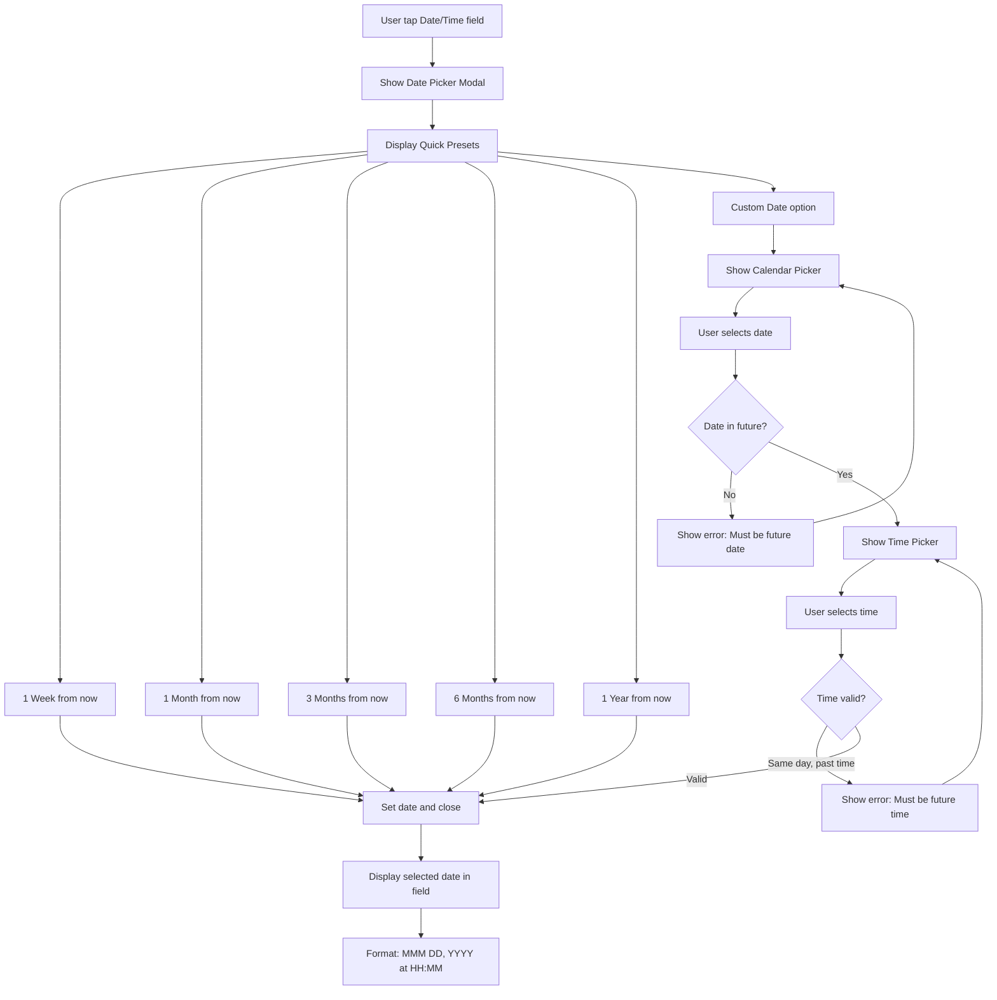
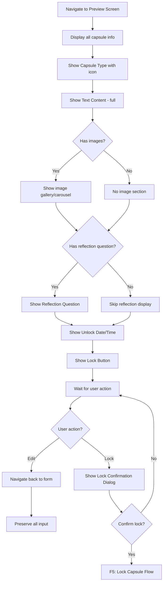

# F4: Create Capsule - Activity Diagram

**Feature ID:** F4
**Priority:** Must Have
**Dependencies:** F1 (Local Data Storage), F3 (Capsule Type Selection)

---

## 1. Overview

Man hinh cho phep user nhap noi dung capsule bao gom: text content (required), anh (optional, max 3), cau hoi reflection (required tru Memory), va thoi gian mo.

---

## 2. Main Activity Diagram



---

## 3. F4.1: Image Selection Flow



---

## 4. Remove Image Flow



---

## 5. F4.2: Date Selection Flow



---

## 6. F4.3: Preview and Lock Flow



---

## 7. Screen Layout - Create Form

```
+----------------------------------------+
|  <- Back      Create [Type]            |
+----------------------------------------+
|                                        |
|  Write your message                    |
|  +----------------------------------+  |
|  |                                  |  |
|  |  [Multi-line text input]         |  |
|  |                                  |  |
|  |                                  |  |
|  +----------------------------------+  |
|  1234/2000 characters                  |
|                                        |
|  Add Photos (optional)                 |
|  +------+ +------+ +------+ +------+   |
|  |[Img1]| |[Img2]| |[Img3]| | [+]  |   |
|  |  X   | |  X   | |  X   | |      |   |
|  +------+ +------+ +------+ +------+   |
|                                        |
|  Reflection Question                   |  <- Hidden for Memory
|  +----------------------------------+  |
|  |  What will you ask yourself?     |  |
|  +----------------------------------+  |
|                                        |
|  Open this capsule on                  |
|  +----------------------------------+  |
|  |  [Calendar icon] Select date...  |  |
|  +----------------------------------+  |
|                                        |
|  +----------------------------------+  |
|  |          Preview                 |  |
|  +----------------------------------+  |
|                                        |
+----------------------------------------+
```

---

## 8. Screen Layout - Preview

```
+----------------------------------------+
|  <- Edit       Preview                 |
+----------------------------------------+
|                                        |
|  [Capsule Type Icon]                   |
|  [Type Name] Capsule                   |
|                                        |
|  +----------------------------------+  |
|  |                                  |  |
|  |  Your message content here...    |  |
|  |  Full text displayed.            |  |
|  |                                  |  |
|  +----------------------------------+  |
|                                        |
|  [Image 1] [Image 2] [Image 3]         |
|                                        |
|  Reflection Question:                  |
|  "Did you achieve this goal?"          |
|                                        |
|  Opens on:                             |
|  December 25, 2025 at 9:00 AM          |
|                                        |
|  +----------------------------------+  |
|  |     [Lock icon] Lock Capsule     |  |
|  +----------------------------------+  |
|                                        |
+----------------------------------------+
```

---

## 9. Validation Rules

| Field | Type | Validation | Error Message |
|-------|------|------------|---------------|
| Content | Text | Required, 1-2000 chars | "Please enter your message (1-2000 characters)" |
| Images | Array | Optional, max 3 | "Maximum 3 images allowed" |
| Reflection Question | Text | Required for Emotion/Goal/Decision | "Please enter a reflection question" |
| Unlock Date | DateTime | Required, must be future | "Please select a future date and time" |

---

## 10. Date/Time Presets

| Preset | Calculation |
|--------|-------------|
| 1 Week | now + 7 days, same time |
| 1 Month | now + 30 days, same time |
| 3 Months | now + 90 days, same time |
| 6 Months | now + 180 days, same time |
| 1 Year | now + 365 days, same time |

---

## 11. Edge Cases

| Case | Handling |
|------|----------|
| Text exactly 2000 chars | Accept, disable further input |
| Text > 2000 chars (paste) | Truncate to 2000, show warning |
| Image picker cancel | No change to selection |
| Image load error | Show placeholder, allow remove |
| Large image file | Resize before save (max 1024px width) |
| Date picker cancel | Keep previous selection |
| Back with unsaved changes | Show "Discard?" confirmation |
| App killed during create | Lost - not saved until lock |

---

## 12. State Management

```typescript
interface CreateCapsuleState {
  type: 'emotion' | 'goal' | 'memory' | 'decision';
  content: string;
  images: ImageUri[];
  reflectionQuestion: string | null;
  unlockDate: Date | null;
  isValid: boolean;
  errors: ValidationErrors;
}
```

---

## 13. Accessibility

| Element | Accessibility |
|---------|---------------|
| Text input | Label: "Write your message", hint: character count |
| Add image button | Label: "Add photo, X of 3 selected" |
| Remove image | Label: "Remove image X" |
| Reflection input | Label: "Reflection question" |
| Date picker | Label: "Select open date", announce selected date |
| Preview button | Label: "Preview capsule" |
| Lock button | Label: "Lock capsule" |

---

*Flow End*
