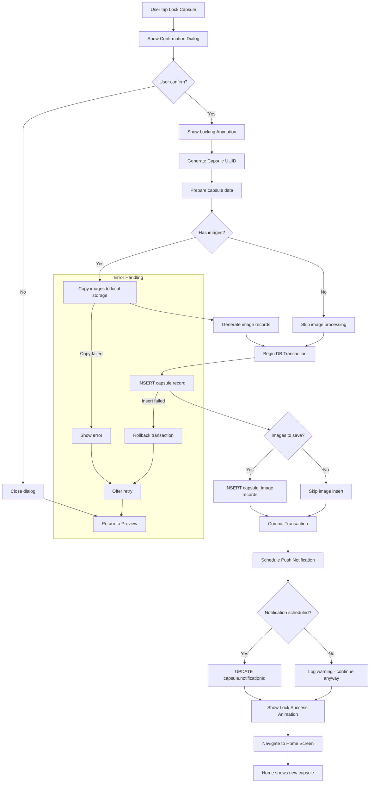
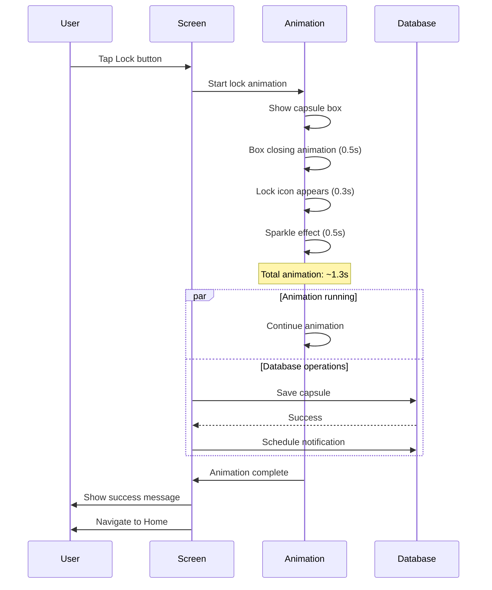
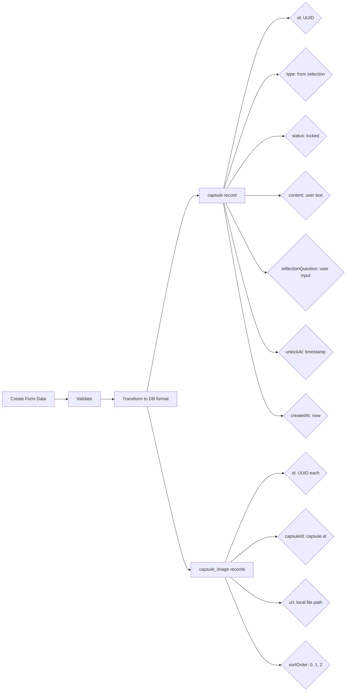
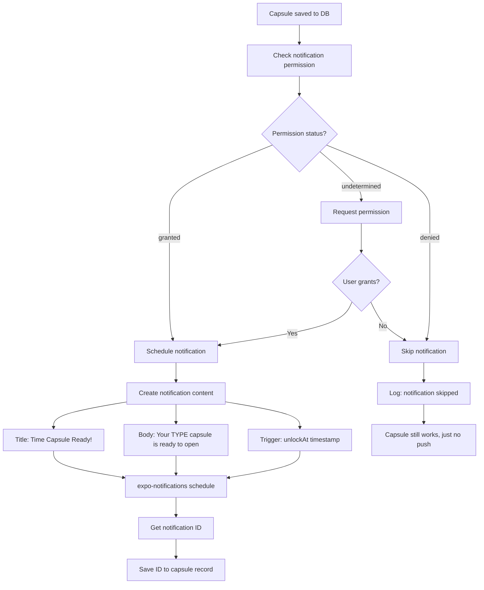
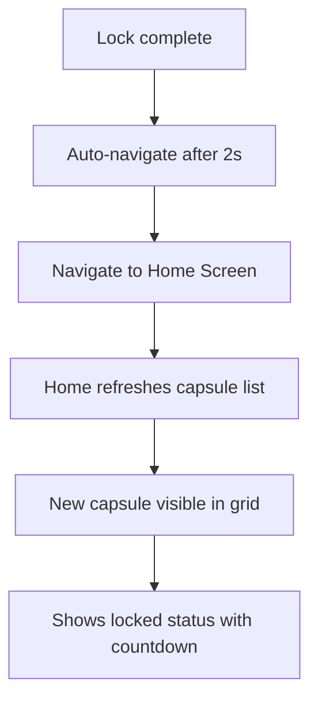

# F5: Lock Capsule - Activity Diagram

**Feature ID:** F5
**Priority:** Must Have
**Dependencies:** F4 (Create Capsule)

---

## 1. Overview

Sau khi user xac nhan tao capsule, he thong se khoa capsule lai. Capsule bi khoa se khong the xem noi dung, sua doi hoac xoa cho den khi den thoi gian mo.

---

## 2. Main Activity Diagram



---

## 3. Lock Animation Sequence



---

## 4. Confirmation Dialog

```
+----------------------------------+
|                                  |
|     Lock this capsule?           |
|                                  |
|  Once locked, you cannot view,   |
|  edit, or delete this capsule    |
|  until it opens on:              |
|                                  |
|  December 25, 2025 at 9:00 AM    |
|                                  |
|  +------------+  +------------+  |
|  |   Cancel   |  |    Lock    |  |
|  +------------+  +------------+  |
|                                  |
+----------------------------------+
```

---

## 5. Lock Success Screen/Animation

```
+----------------------------------------+
|                                        |
|                                        |
|              [Box Icon]                |
|            closing animation           |
|                                        |
|              [Lock Icon]               |
|                 click!                 |
|                                        |
|           Capsule Locked!              |
|                                        |
|    Your capsule will open in          |
|           30 days                      |
|                                        |
|                                        |
+----------------------------------------+
```

---

## 6. Data Flow



---

## 7. Notification Scheduling



---

## 8. Capsule Status After Lock

| Field | Value |
|-------|-------|
| status | 'locked' |
| content | Stored but not accessible via UI |
| images | Stored in local filesystem |
| reflectionQuestion | Stored but not shown |
| reflectionAnswer | NULL |
| unlockAt | Future timestamp |
| createdAt | Now |
| openedAt | NULL |
| notificationId | Expo notification ID or NULL |

---

## 9. Locked Capsule Restrictions

| Action | Allowed? | Reason |
|--------|----------|--------|
| View content | No | Preserve surprise element |
| View images | No | Preserve surprise element |
| Edit content | No | Maintain authenticity |
| Edit unlock date | No | Prevent cheating |
| Delete capsule | No | Preserve commitment |
| See countdown | Yes | Build anticipation |
| See capsule type | Yes | Identification only |

---

## 10. Edge Cases

| Case | Handling |
|------|----------|
| App killed during save | Transaction rollback, no partial data |
| Storage full | Show error before saving |
| Image copy fails | Rollback, show error, allow retry |
| Notification permission denied | Save capsule anyway, warn user |
| Device offline | Works fine (local only) |
| Very long unlock time (years) | Accept, notification may not work |
| Unlock time just passed (race) | Set status to 'ready' immediately |

---

## 11. Animation Specifications

| Animation | Duration | Easing | Description |
|-----------|----------|--------|-------------|
| Box appear | 300ms | ease-out | Scale from 0.8 to 1.0 |
| Box close | 500ms | ease-in-out | Lid closing animation |
| Lock click | 200ms | spring | Lock icon bounces |
| Sparkles | 500ms | linear | Particles radiate outward |
| Success text | 300ms | ease-out | Fade in and slide up |
| Screen transition | 300ms | ease-out | Fade to Home |

---

## 12. Haptic Feedback

| Event | Haptic Type |
|-------|-------------|
| Tap Lock button | Light |
| Lock animation complete | Heavy (success) |
| Error occurs | Error pattern |

---

## 13. Post-Lock Navigation



---

*Flow End*
