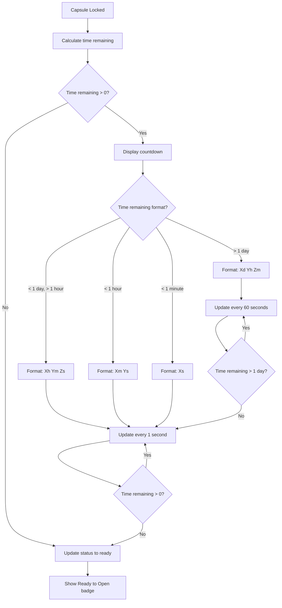
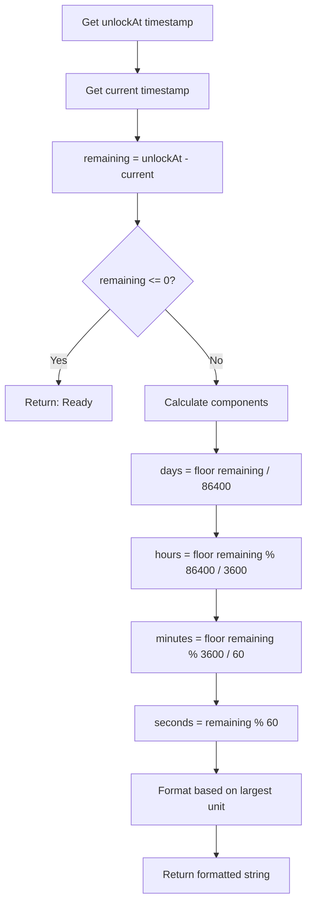
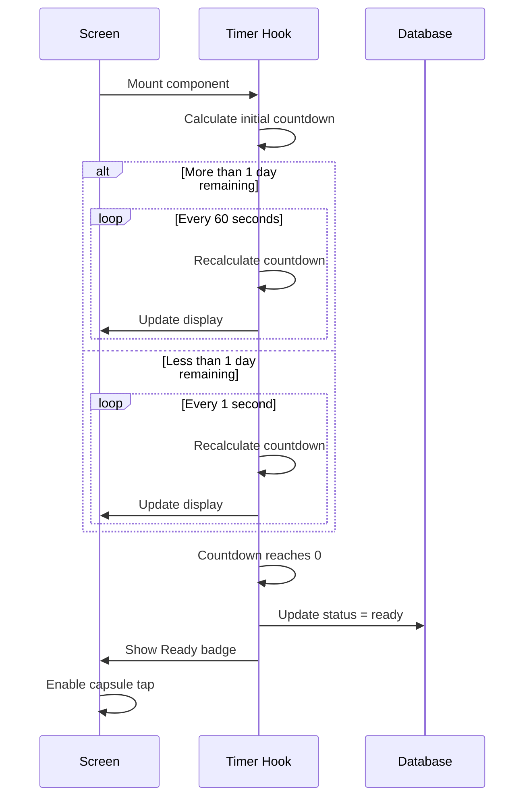
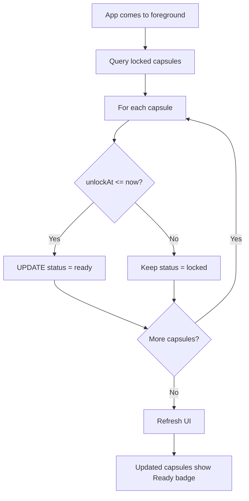
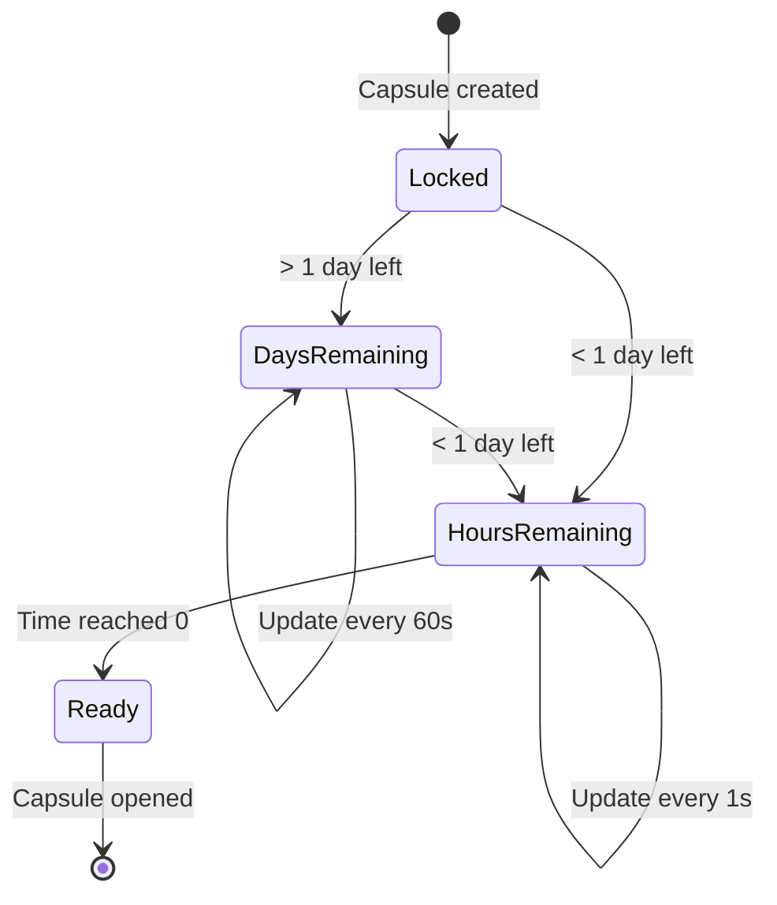
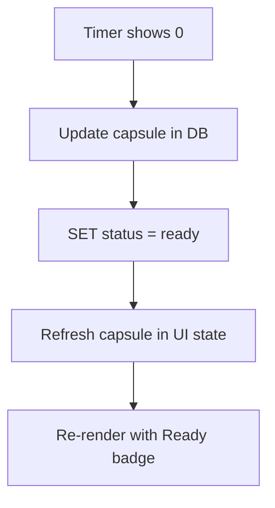

# F6: Capsule Timer - Activity Diagram

**Feature ID:** F6
**Priority:** Must Have
**Dependencies:** F5 (Lock Capsule)

---

## 1. Overview

Hien thi countdown timer cho moi capsule dang bi khoa. Timer update real-time va tu dong chuyen status tu 'locked' sang 'ready' khi het thoi gian.

---

## 2. Main Activity Diagram



---

## 3. Timer Calculation Flow



---

## 4. Timer Update Strategy



---

## 5. Background Status Check



---

## 6. Timer Display Formats

### 6.1 Long Duration (> 1 day)

```
+------------------+
|  [Capsule Icon]  |
|                  |
|   30d 5h 45m     |  <- Days, hours, minutes
|                  |
|  [Lock Icon]     |
+------------------+
```

### 6.2 Medium Duration (< 1 day, > 1 hour)

```
+------------------+
|  [Capsule Icon]  |
|                  |
|   5:30:45        |  <- Hours:Minutes:Seconds
|                  |
|  [Lock Icon]     |
+------------------+
```

### 6.3 Short Duration (< 1 hour)

```
+------------------+
|  [Capsule Icon]  |
|                  |
|   45:30          |  <- Minutes:Seconds
|                  |
|  [Lock Icon]     |
+------------------+
```

### 6.4 Very Short (< 1 minute)

```
+------------------+
|  [Capsule Icon]  |
|                  |
|   30s            |  <- Seconds only
|                  |
|  [Lock Icon]     |
+------------------+
```

### 6.5 Ready State

```
+------------------+
|  [Capsule Icon]  |
|                  |
|  Ready to Open!  |  <- No countdown
|                  |
|  [Unlock Icon]   |
+------------------+
```

---

## 7. Timer State Machine



---

## 8. Timer Hook Implementation Concept

```typescript
interface TimerState {
  remaining: number;      // seconds
  formatted: string;      // display string
  isReady: boolean;
  updateInterval: number; // 1000 or 60000 ms
}

function useCountdown(unlockAt: number): TimerState {
  // Calculate remaining time
  // Set appropriate update interval
  // Return formatted string
  // Auto-update status when ready
}
```

---

## 9. Performance Optimizations

| Optimization | Description |
|--------------|-------------|
| Conditional interval | 60s updates for long duration, 1s for short |
| Batch updates | Update all capsule timers in single render |
| Cleanup on unmount | Clear interval when component unmounts |
| Memoization | Memoize format function |
| Lazy calculation | Only calculate visible capsules |

---

## 10. Edge Cases

| Case | Handling |
|------|----------|
| App in background | No updates, check on foreground |
| Device clock changed | Recalculate on foreground |
| Multiple capsules same time | All become ready simultaneously |
| Unlock time in past (after install) | Immediately show Ready |
| Very long duration (years) | Show in days, warn about notification reliability |
| Negative remaining time | Show Ready, update status |

---

## 11. Timer Accuracy

| Scenario | Accuracy |
|----------|----------|
| > 1 day remaining | +/- 60 seconds |
| < 1 day remaining | +/- 1 second |
| Status transition | Within 1 second of actual time |

---

## 12. Visual Transitions

| Transition | Animation |
|------------|-----------|
| Number change | No animation (direct update) |
| Format change (days -> hours) | Subtle pulse |
| Locked -> Ready | Badge appears with scale animation |
| Color change near ready | Gradual color shift in last hour |

---

## 13. Accessibility

| Element | Accessibility |
|---------|---------------|
| Countdown text | Announce "X days Y hours remaining" |
| Ready badge | Announce "Capsule is ready to open" |
| Timer updates | Don't announce every second (too noisy) |

---

## 14. Sync with Database



---

*Flow End*
