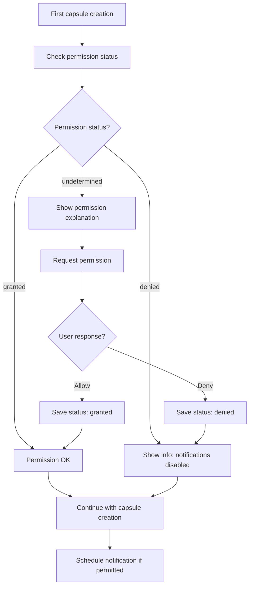
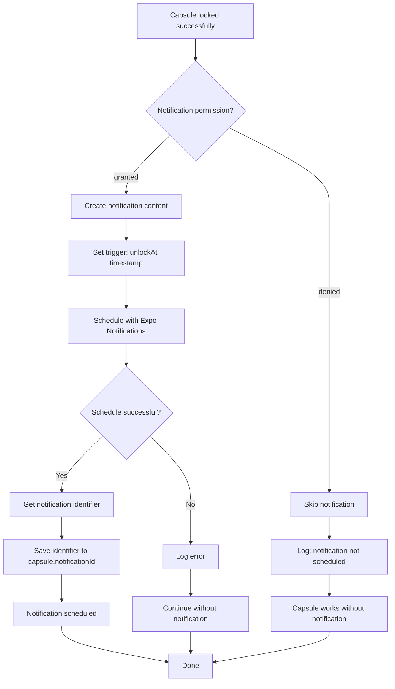
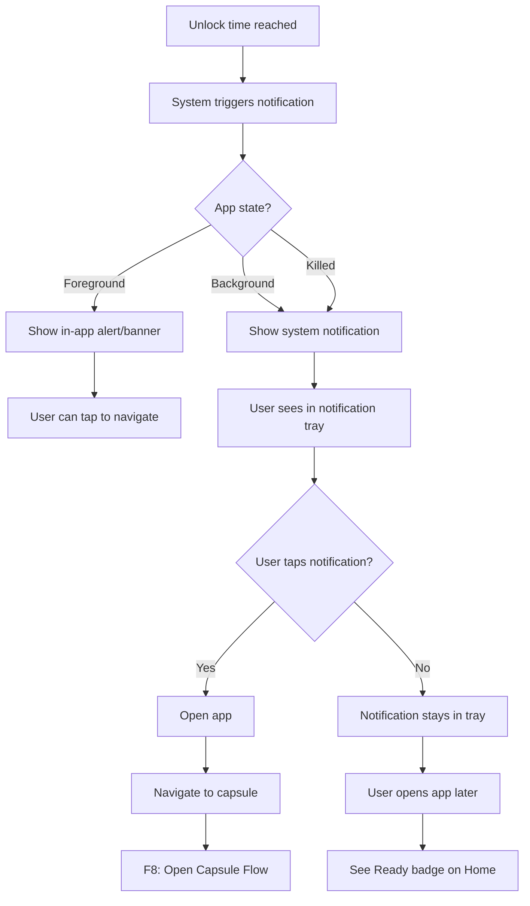
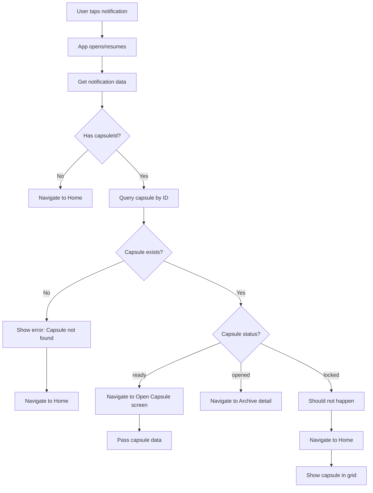
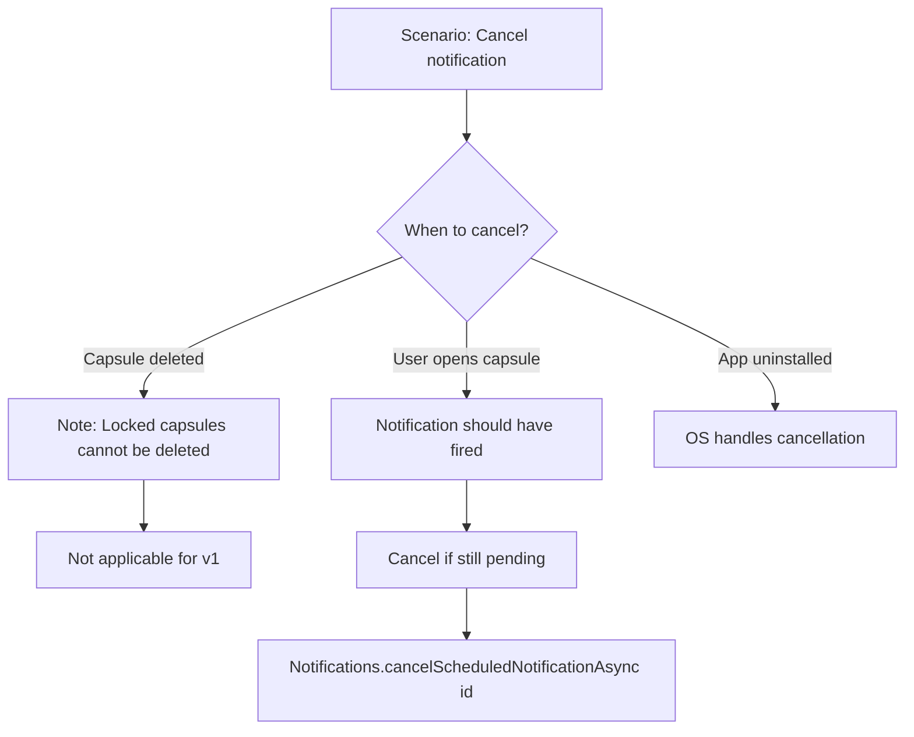
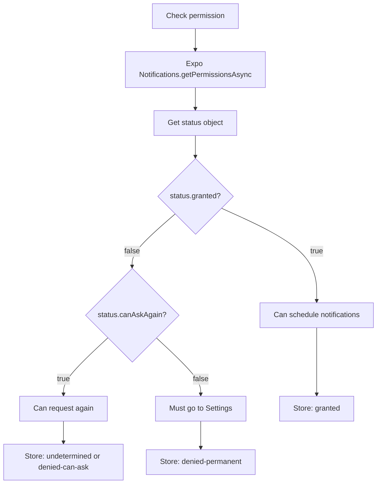
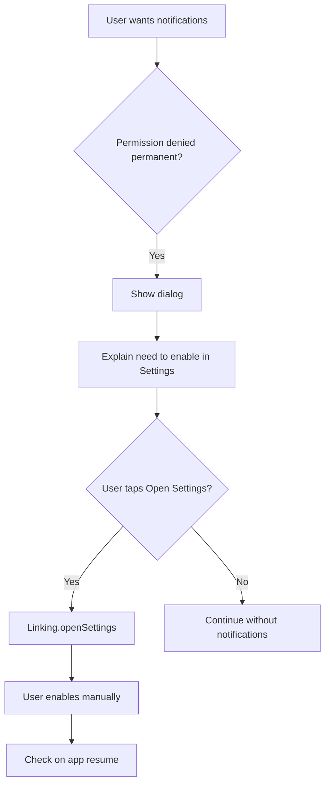
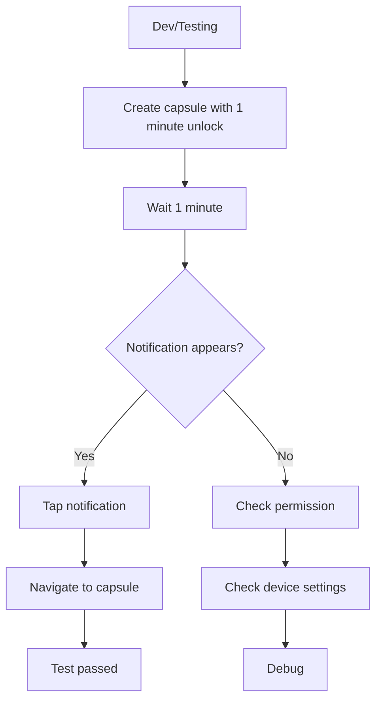

# F7: Push Notification - Activity Diagram

**Feature ID:** F7
**Priority:** Must Have
**Dependencies:** F5 (Lock Capsule)

---

## 1. Overview

Gu thong bao day (local push notification) khi capsule den thoi gian mo. Su dung Expo Notifications de schedule notification tai thoi diem lock capsule.

---

## 2. Permission Request Flow



---

## 3. Notification Scheduling Flow



---

## 4. Notification Content by Type

| Capsule Type | Title | Body |
|--------------|-------|------|
| Emotion | Time Capsule Ready! | Your Emotion capsule is ready to open |
| Goal | Time Capsule Ready! | Your Goal capsule is ready to open |
| Memory | Time Capsule Ready! | Your Memory capsule is ready to open |
| Decision | Time Capsule Ready! | Your Decision capsule is ready to open |

---

## 5. Notification Delivery Flow



---

## 6. Notification Tap Handler



---

## 7. Notification Data Structure

```typescript
interface NotificationContent {
  title: string;
  body: string;
  data: {
    capsuleId: string;
    capsuleType: CapsuleType;
  };
  sound: 'default';
}

interface NotificationTrigger {
  type: 'date';
  date: Date; // unlockAt timestamp
}
```

---

## 8. Permission Explanation Screen

```
+----------------------------------------+
|                                        |
|         [Bell Icon Animation]          |
|                                        |
|     Stay Connected to Your            |
|        Time Capsules                   |
|                                        |
|  We'll notify you when your capsules  |
|  are ready to open, so you never      |
|  miss a moment from your past self.   |
|                                        |
|  +----------------------------------+  |
|  |        Enable Notifications      |  |
|  +----------------------------------+  |
|                                        |
|          Maybe Later                   |
|                                        |
+----------------------------------------+
```

---

## 9. In-App Notification (Foreground)

```
+----------------------------------------+
|  [Bell] Time Capsule Ready!     [X]   |
|  Your Goal capsule is ready to open   |
|                              [View]    |
+----------------------------------------+
```

---

## 10. Edge Cases

| Case | Handling |
|------|----------|
| Permission denied | Capsule works, no notification |
| User revokes permission later | Scheduled notifications still fire (already scheduled) |
| Device restarted | Expo handles re-scheduling |
| App uninstalled before unlock | Notifications cancelled by OS |
| Notification tap after app killed | Deep link to capsule |
| Multiple capsules same time | Multiple notifications |
| Very far future (years) | Notification may not be reliable |
| Past unlock time | No notification, capsule ready immediately |

---

## 11. Notification Cancellation



Note: Trong v1, capsule locked khong the xoa nen khong can cancel notification. Sau khi capsule opened, notification da fire roi.

---

## 12. Permission Status Persistence



---

## 13. Settings Deep Link

Khi user da deny permission va can enable lai:



---

## 14. Notification Sound & Vibration

| Setting | Value |
|---------|-------|
| Sound | Default system sound |
| Vibration | Default pattern |
| Badge | Not used (no badge count) |
| Priority | High (important) |

---

## 15. Testing Notification



---

*Flow End*
