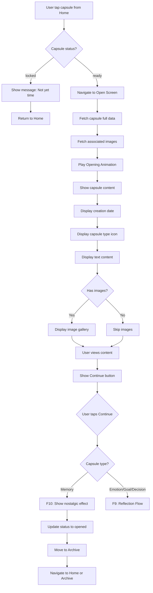
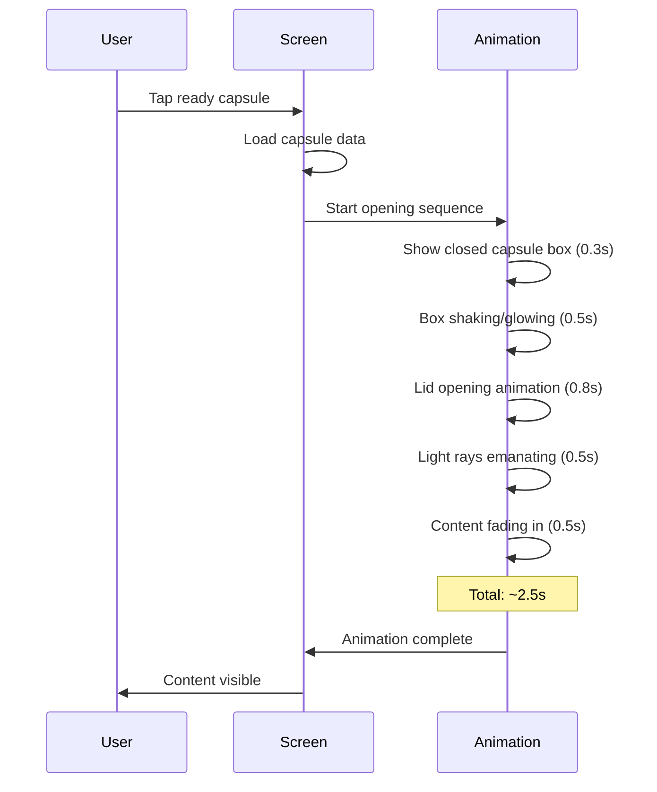
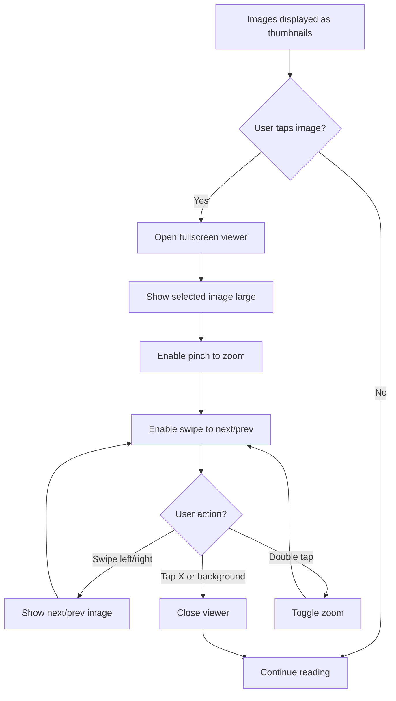
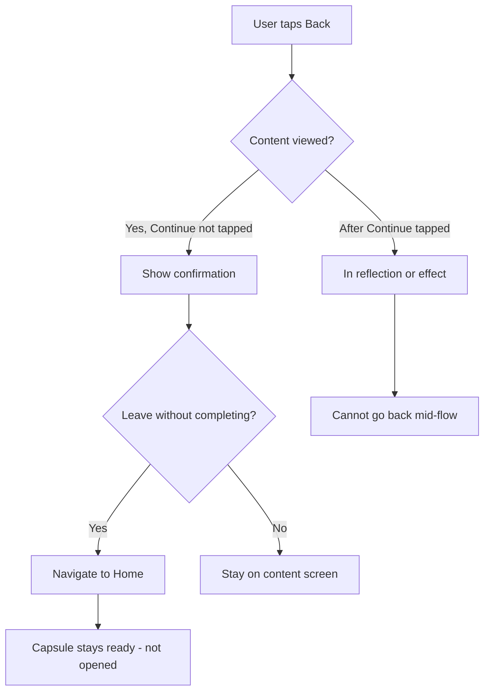
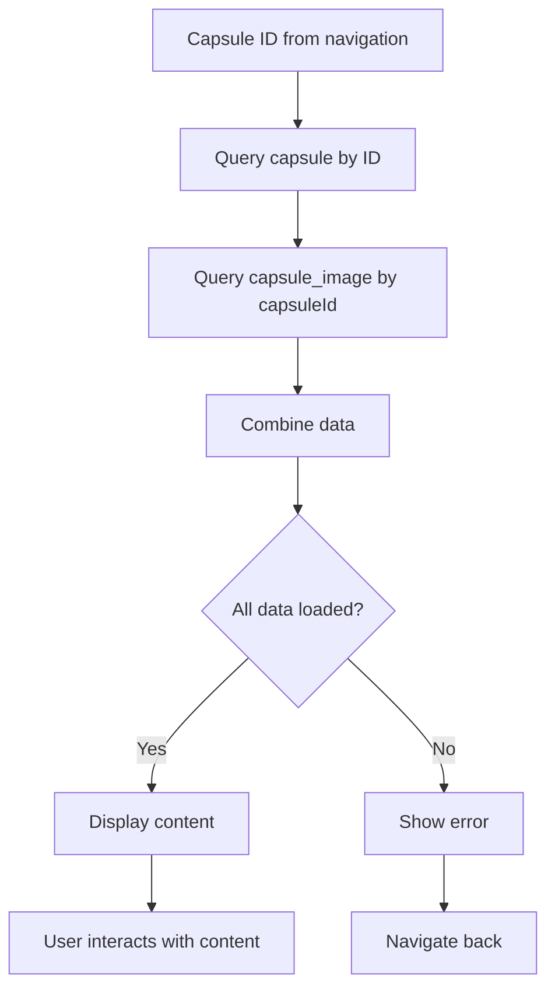
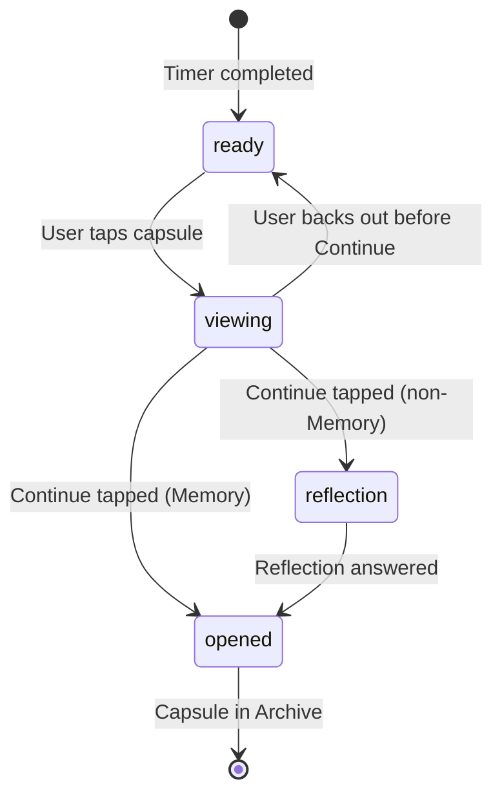

# F8: Open Capsule - Activity Diagram

**Feature ID:** F8
**Priority:** Must Have
**Dependencies:** F5 (Lock Capsule), F6 (Capsule Timer)

---

## 1. Overview

Cho phep user mo capsule khi da den thoi gian (status = ready). Hien thi noi dung capsule voi animation mo hop va sau do chuyen sang reflection (neu co).

---

## 2. Main Activity Diagram



---

## 3. Opening Animation Sequence



---

## 4. Content Display Screen

```
+----------------------------------------+
|  <- Back                               |
+----------------------------------------+
|                                        |
|  [Opening Animation plays here]        |
|                                        |
|  ---- After animation ----             |
|                                        |
|  [Capsule Type Icon]                   |
|  Created on November 25, 2024          |
|                                        |
|  +----------------------------------+  |
|  |                                  |  |
|  |  Your message content here.     |  |
|  |  This is what you wrote to      |  |
|  |  your future self. All the      |  |
|  |  text is displayed in full.     |  |
|  |                                  |  |
|  +----------------------------------+  |
|                                        |
|  [Image 1] [Image 2] [Image 3]         |
|  (tap to zoom)                         |
|                                        |
|  +----------------------------------+  |
|  |          Continue                |  |
|  +----------------------------------+  |
|                                        |
+----------------------------------------+
```

---

## 5. Image Viewing Flow



---

## 6. Back Navigation Handling



Note: Neu user back truoc khi tap Continue, capsule van o trang thai ready va co the mo lai sau.

---

## 7. Content Display Rules

| Element | Display Rule |
|---------|--------------|
| Type icon | Always shown with type-specific color |
| Creation date | Format: "Created on [Month DD, YYYY]" |
| Text content | Full text, scrollable if long |
| Images | Thumbnails with tap-to-expand |
| Reflection question | NOT shown yet (shown in F9) |

---

## 8. Animation Specifications

### 8.1 Opening Animation

| Phase | Duration | Effect |
|-------|----------|--------|
| Box appear | 300ms | Fade in, centered |
| Box shake | 500ms | Subtle shake, glow increases |
| Lid open | 800ms | 3D rotation upward |
| Light burst | 500ms | Rays emanate from box |
| Content reveal | 500ms | Fade in, slide up |

### 8.2 Skip Animation

| Trigger | Action |
|---------|--------|
| Tap anywhere during animation | Skip to content display |
| Animation complete | Auto-show content |

---

## 9. Data Flow



---

## 10. Edge Cases

| Case | Handling |
|------|----------|
| Capsule not found (deleted externally) | Show error, navigate home |
| Images not found (corrupted) | Show placeholder, allow continue |
| Very long text | Scrollable container |
| No images | Hide image section |
| User force closes during open | Capsule stays ready |
| Network error | N/A - all local |
| Animation lag on slow device | Reduce animation complexity |

---

## 11. Capsule Status Transition



---

## 12. Screen States

| State | Content |
|-------|---------|
| Loading | Spinner while fetching data |
| Animating | Opening animation playing |
| Displaying | Content visible, can interact |
| Image View | Fullscreen image viewer open |

---

## 13. Accessibility

| Element | Accessibility |
|---------|---------------|
| Opening animation | Reducible for motion sensitivity |
| Content text | Full text read by screen reader |
| Images | Alt text: "Image X of Y" |
| Continue button | Label: "Continue to reflection" or "Complete viewing" |
| Back button | Label: "Go back" |

---

## 14. Haptic Feedback

| Event | Haptic |
|-------|--------|
| Animation start | Light |
| Content revealed | Medium |
| Image tap | Light |
| Continue tap | Medium |

---

*Flow End*
