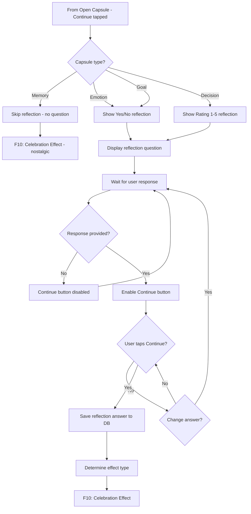
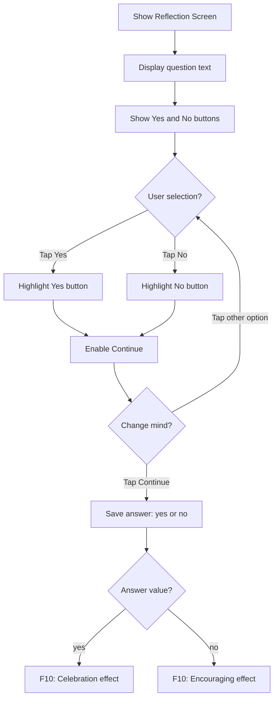
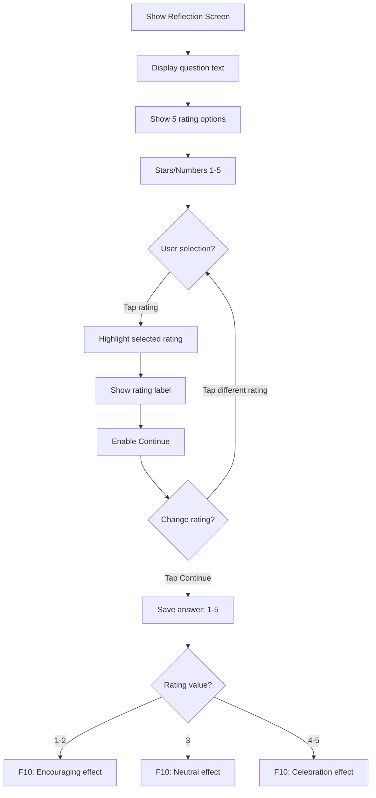
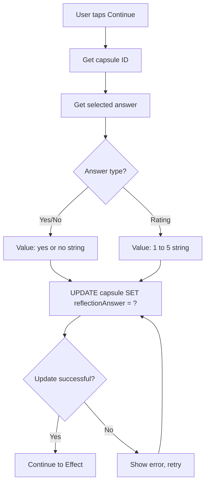
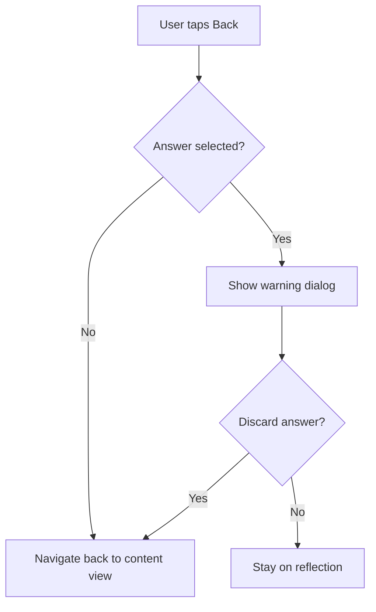

# F9: Reflection Response - Activity Diagram

**Feature ID:** F9
**Priority:** Must Have
**Dependencies:** F8 (Open Capsule)

---

## 1. Overview

Sau khi xem noi dung capsule, user tra loi cau hoi reflection ma ho da dat ra khi tao capsule. Moi loai capsule co kieu tra loi khac nhau: Yes/No hoac Rating 1-5.

---

## 2. Main Activity Diagram



---

## 3. Yes/No Reflection Flow (Emotion, Goal)



---

## 4. Rating Reflection Flow (Decision)



---

## 5. Reflection Screen Layout - Yes/No

```
+----------------------------------------+
|                                        |
|                                        |
|  [Capsule Type Icon]                   |
|                                        |
|  Reflect on your [Type]                |
|                                        |
|  +----------------------------------+  |
|  |                                  |  |
|  |  "Did you achieve this goal?"   |  |  <- User's question
|  |                                  |  |
|  +----------------------------------+  |
|                                        |
|                                        |
|  +---------------+  +---------------+  |
|  |      Yes      |  |      No       |  |
|  |      [v]      |  |      [x]      |  |
|  +---------------+  +---------------+  |
|                                        |
|                                        |
|  +----------------------------------+  |
|  |          Continue                |  |  <- Disabled until selection
|  +----------------------------------+  |
|                                        |
+----------------------------------------+
```

---

## 6. Reflection Screen Layout - Rating

```
+----------------------------------------+
|                                        |
|                                        |
|  [Capsule Type Icon]                   |
|                                        |
|  Rate your decision                    |
|                                        |
|  +----------------------------------+  |
|  |                                  |  |
|  |  "Was this the right choice?"   |  |  <- User's question
|  |                                  |  |
|  +----------------------------------+  |
|                                        |
|                                        |
|     [1]   [2]   [3]   [4]   [5]        |
|      *     *     *     *     *         |  <- Stars or circles
|                                        |
|     Poor  -     OK    -   Great        |  <- Labels
|                                        |
|                                        |
|  +----------------------------------+  |
|  |          Continue                |  |  <- Disabled until selection
|  +----------------------------------+  |
|                                        |
+----------------------------------------+
```

---

## 7. Rating Labels

| Rating | Label | Color |
|--------|-------|-------|
| 1 | Poor decision | Red |
| 2 | Below expectations | Orange |
| 3 | Neutral / Okay | Yellow |
| 4 | Good decision | Light Green |
| 5 | Excellent decision | Green |

---

## 8. Selection States

### 8.1 Yes/No Buttons

| State | Appearance |
|-------|------------|
| Unselected | Outlined, muted color |
| Selected | Filled, vibrant color, checkmark |
| Hover/Press | Slight scale down |

### 8.2 Rating Stars/Numbers

| State | Appearance |
|-------|------------|
| Unselected | Empty star / gray number |
| Selected | Filled star / colored number |
| All up to selected | Stars 1-X filled |

---

## 9. Data Persistence



---

## 10. Effect Mapping

| Type | Answer | Effect |
|------|--------|--------|
| Emotion | Yes | Celebration (confetti) |
| Emotion | No | Encouraging (gentle) |
| Goal | Yes | Achievement (confetti, sparkles) |
| Goal | No | Encouraging (supportive message) |
| Decision | 4-5 | Celebration (good decision!) |
| Decision | 3 | Neutral (thoughtful) |
| Decision | 1-2 | Encouraging (learning experience) |
| Memory | N/A | Nostalgic (warm, soft) |

---

## 11. Validation

| Field | Validation |
|-------|------------|
| Answer | Required - must select before Continue |
| Continue | Disabled until valid selection |

---

## 12. Edge Cases

| Case | Handling |
|------|----------|
| No reflection question (Memory) | Skip this screen entirely |
| User backs out | Show warning, answer not saved |
| Change answer before Continue | Allow, update highlight |
| Double tap | Ignored after first tap |
| Very long question | Scrollable question area |
| App killed mid-reflection | Answer not saved, capsule still ready |

---

## 13. Back Navigation



Note: Sau khi back, user co the xem lai content va quay lai reflection.

---

## 14. Accessibility

| Element | Accessibility |
|---------|---------------|
| Question | Role: text, full question read |
| Yes button | Role: button, state: selected/unselected |
| No button | Role: button, state: selected/unselected |
| Rating 1-5 | Role: slider or radio group |
| Continue | Role: button, state: disabled/enabled |

---

## 15. Haptic Feedback

| Action | Haptic |
|--------|--------|
| Select Yes/No | Light |
| Select rating | Light |
| Tap Continue | Medium |

---

## 16. Animation

| Animation | Description |
|-----------|-------------|
| Button select | Scale bounce (1.0 -> 0.95 -> 1.0) |
| Star fill | Sequential fill animation |
| Continue enable | Fade in, slight lift |

---

*Flow End*
