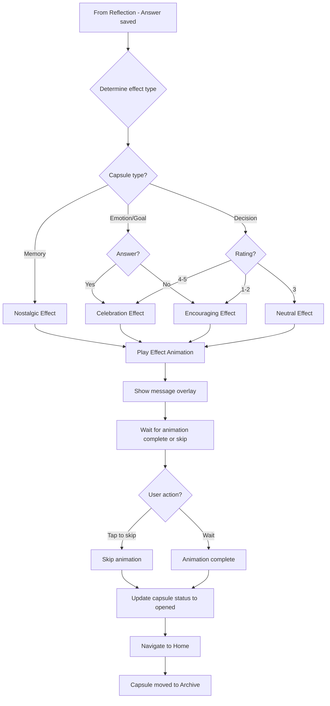
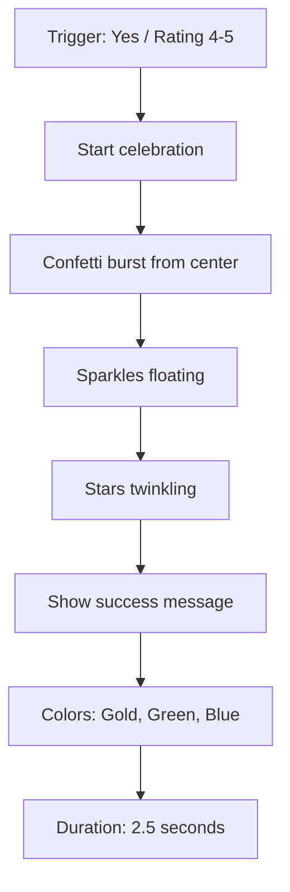
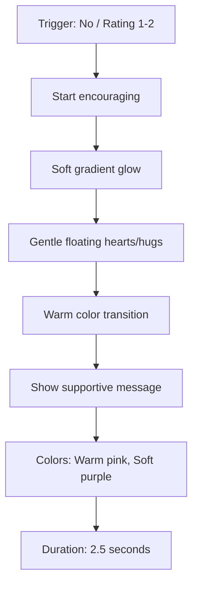
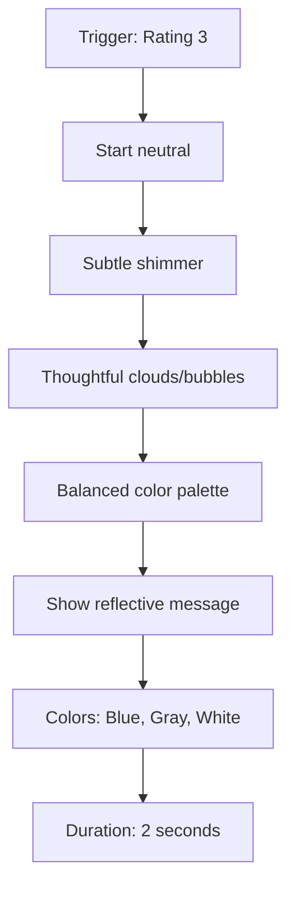
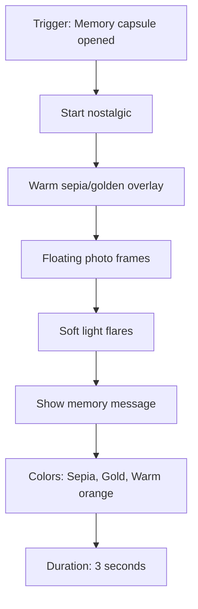
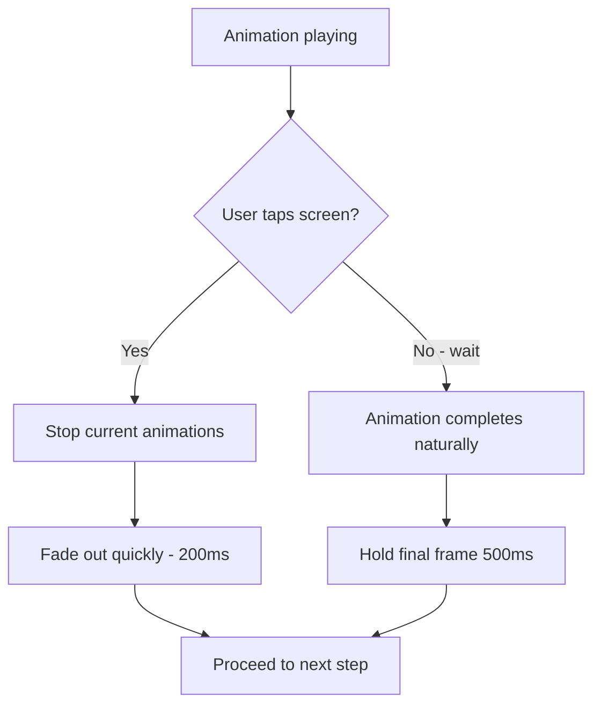
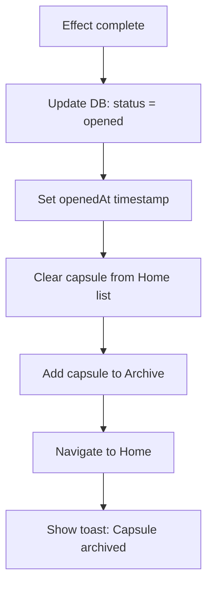

# F10: Celebration Effects - Activity Diagram

**Feature ID:** F10
**Priority:** Should Have
**Dependencies:** F9 (Reflection Response)

---

## 1. Overview

Hieu ung animation sau khi user tra loi reflection hoac xem xong Memory capsule. Moi loai tra loi se co hieu ung phu hop voi cam xuc.

---

## 2. Main Activity Diagram



---

## 3. Effect Types

### 3.1 Celebration Effect (Positive)



**Visual:**
```
+----------------------------------------+
|    *  *     *                    *     |
|  *    [Confetti]  *      *             |
|     *       *        *                 |
|                                        |
|           Congratulations!             |
|                                        |
|      You achieved your goal!           |
|                                        |
|    *         *     *          *        |
|                                        |
|         (tap anywhere to continue)     |
+----------------------------------------+
```

---

### 3.2 Encouraging Effect (Negative/Low)



**Visual:**
```
+----------------------------------------+
|                                        |
|             ~  ~  ~  ~                 |
|                                        |
|          It's okay!                    |
|                                        |
|   Every experience is a lesson.        |
|   You're growing every day.            |
|                                        |
|              <3   <3                   |
|                                        |
|         (tap anywhere to continue)     |
+----------------------------------------+
```

---

### 3.3 Neutral Effect (Middle Rating)



**Visual:**
```
+----------------------------------------+
|                                        |
|           o   o   o   o                |
|                                        |
|          Interesting!                  |
|                                        |
|   Life is full of nuances.             |
|   Reflect and move forward.            |
|                                        |
|              o   o                     |
|                                        |
|         (tap anywhere to continue)     |
+----------------------------------------+
```

---

### 3.4 Nostalgic Effect (Memory)



**Visual:**
```
+----------------------------------------+
|                                        |
|    [~]       [~]         [~]           |
|                                        |
|          A Beautiful Memory            |
|                                        |
|    Cherish these moments forever.      |
|                                        |
|           * glow *                     |
|                                        |
|         (tap anywhere to continue)     |
+----------------------------------------+
```

---

## 4. Effect Messages

### 4.1 Celebration Messages

| Context | Message Options |
|---------|-----------------|
| Goal - Yes | "Congratulations! You did it!", "Goal achieved!", "You're amazing!" |
| Emotion - Yes | "Wonderful!", "Glad things worked out!", "Great news!" |
| Decision - 4-5 | "Great decision!", "You chose wisely!", "Well done!" |

### 4.2 Encouraging Messages

| Context | Message Options |
|---------|-----------------|
| Goal - No | "That's okay, keep trying!", "Every step counts!", "Progress, not perfection!" |
| Emotion - No | "It's okay to feel this way.", "Tomorrow is a new day!", "You're stronger than you know." |
| Decision - 1-2 | "Learning experience!", "Now you know better!", "Growth comes from challenges." |

### 4.3 Neutral Messages

| Context | Message Options |
|---------|-----------------|
| Decision - 3 | "Interesting outcome!", "Life is full of nuances.", "Every choice teaches us something." |

### 4.4 Nostalgic Messages

| Context | Message Options |
|---------|-----------------|
| Memory | "A beautiful memory!", "Cherish this moment.", "Memories last forever." |

---

## 5. Animation Specifications

### 5.1 Celebration (Confetti + Sparkles)

| Element | Duration | Easing | Details |
|---------|----------|--------|---------|
| Confetti burst | 2000ms | ease-out | 50+ particles, physics-based fall |
| Sparkles | 1500ms | linear | Random positions, twinkle |
| Message fade in | 300ms | ease-out | Center of screen |
| Background glow | 500ms | ease-in-out | Radial gradient pulse |

### 5.2 Encouraging (Soft Glow)

| Element | Duration | Easing | Details |
|---------|----------|--------|---------|
| Gradient shift | 2000ms | linear | Warm colors transition |
| Floating hearts | 2500ms | ease-in-out | 5-10 hearts, float upward |
| Message fade in | 400ms | ease-out | Gentle appearance |

### 5.3 Neutral (Shimmer)

| Element | Duration | Easing | Details |
|---------|----------|--------|---------|
| Shimmer wave | 1500ms | linear | Horizontal sweep |
| Bubbles | 2000ms | ease-out | Float upward, pop |
| Message fade in | 300ms | ease-out | Center |

### 5.4 Nostalgic (Warm Glow)

| Element | Duration | Easing | Details |
|---------|----------|--------|---------|
| Sepia overlay | 500ms | ease-in | Full screen tint |
| Light flares | 2500ms | ease-in-out | Lens flare effect |
| Photo frames | 2000ms | ease-out | Float and rotate slightly |
| Message fade in | 400ms | ease-out | Center |

---

## 6. Skip Behavior



---

## 7. Implementation Notes

### 7.1 Lottie vs Custom Animation

| Approach | Pros | Cons |
|----------|------|------|
| Lottie | Pre-made, smooth, easy | File size, limited customization |
| Reanimated | Full control, smaller | More dev time |
| Hybrid | Best of both | Complexity |

**Recommendation:** Use Lottie for complex effects (confetti, sparkles), Reanimated for simple transitions.

### 7.2 Performance Considerations

| Consideration | Solution |
|---------------|----------|
| Many particles | Limit to 50-100 |
| Frame rate | Target 60fps, degrade gracefully |
| Memory | Cleanup animations after complete |
| Low-end devices | Reduce particle count |

---

## 8. Sound Effects (Optional)

| Effect | Sound |
|--------|-------|
| Celebration | Pop/chime sound |
| Encouraging | Soft harp/chime |
| Neutral | Subtle ding |
| Nostalgic | Soft music box note |

Note: Sounds optional, respect device silent mode.

---

## 9. Haptic Feedback

| Effect | Haptic |
|--------|--------|
| Celebration start | Medium impact |
| Celebration peak | Heavy impact |
| Encouraging | Light impact |
| Neutral | Light impact |
| Nostalgic | Medium impact |

---

## 10. Edge Cases

| Case | Handling |
|------|----------|
| Skip immediately | Quick fade, proceed |
| Animation error | Skip to next, no crash |
| Low memory | Reduce particle count |
| Background mid-animation | Complete in background, proceed on resume |
| Screen rotate | Maintain animation, adjust layout |

---

## 11. Post-Effect Navigation



---

## 12. Accessibility

| Feature | Implementation |
|---------|----------------|
| Motion sensitivity | Reduce motion option - skip effects |
| Screen reader | Announce message text |
| Skip hint | Show "tap to skip" text |
| Color contrast | Ensure message readable |

---

*Flow End*
