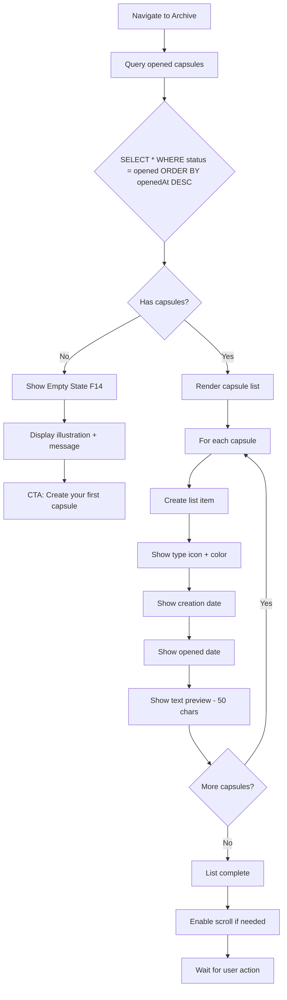
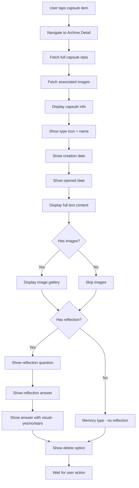
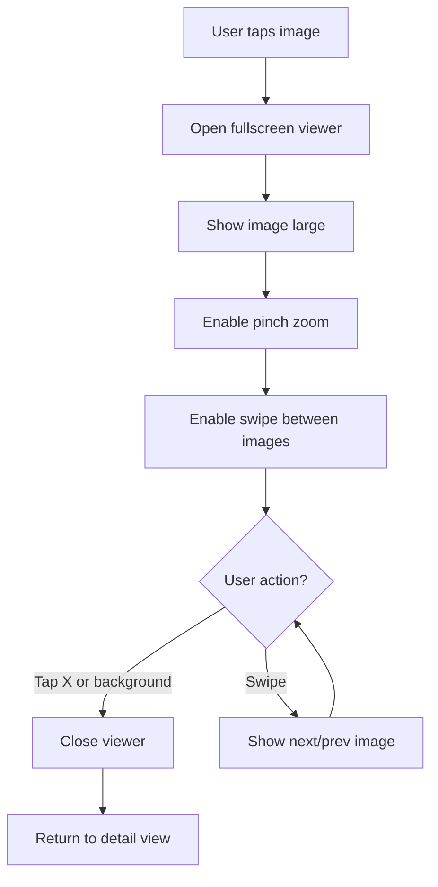
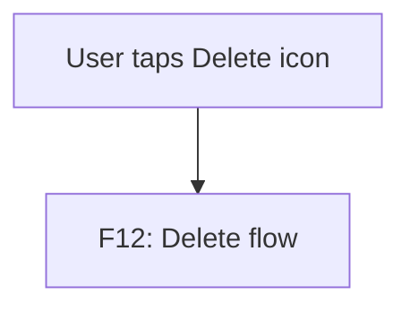
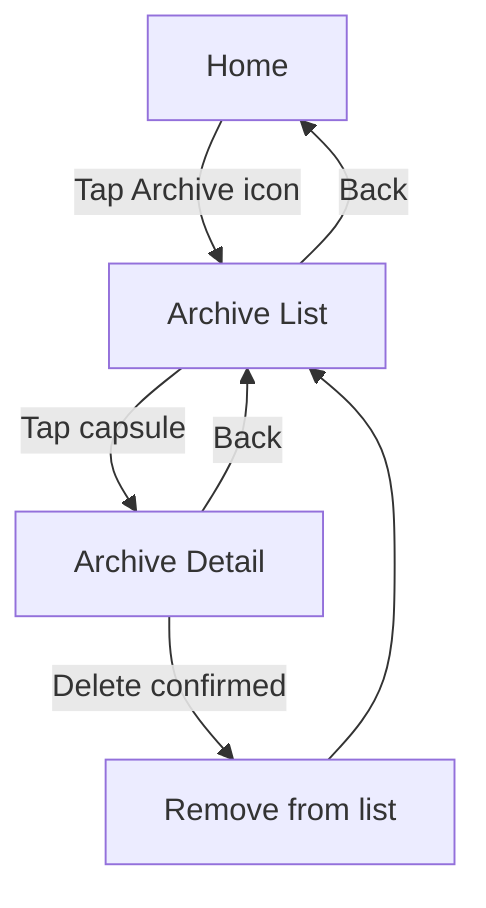
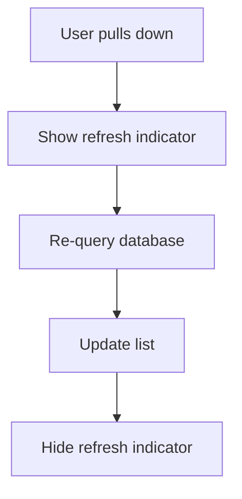

# F11: Archive/History - Activity Diagram

**Feature ID:** F11
**Priority:** Must Have
**Dependencies:** F8 (Open Capsule)

---

## 1. Overview

Man hinh Archive luu tru va hien thi tat ca capsules da mo (status = opened). User co the xem lai noi dung va reflection cua cac capsules cu.

---

## 2. Main Activity Diagram



---

## 3. View Capsule Detail Flow



---

## 4. Archive List Screen Layout

```
+----------------------------------------+
|  <- Back            Archive            |
+----------------------------------------+
|                                        |
|  Your Opened Capsules                  |
|                                        |
|  +----------------------------------+  |
|  | [Heart] Emotion                  |  |
|  | Created: Nov 25, 2024            |  |
|  | Opened: Dec 25, 2024             |  |
|  | "Today I felt really happy..."   |  |
|  +----------------------------------+  |
|                                        |
|  +----------------------------------+  |
|  | [Target] Goal                    |  |
|  | Created: Oct 1, 2024             |  |
|  | Opened: Dec 20, 2024             |  |
|  | "I want to learn React..."       |  |
|  +----------------------------------+  |
|                                        |
|  +----------------------------------+  |
|  | [Photo] Memory                   |  |
|  | Created: Aug 15, 2024            |  |
|  | Opened: Dec 15, 2024             |  |
|  | "My birthday party was..."       |  |
|  +----------------------------------+  |
|                                        |
|        (Scroll for more)               |
+----------------------------------------+
```

---

## 5. Archive Detail Screen Layout

```
+----------------------------------------+
|  <- Back        [Type] Capsule  [Del] |
+----------------------------------------+
|                                        |
|  [Capsule Type Icon]                   |
|                                        |
|  Created: November 25, 2024            |
|  Opened: December 25, 2024             |
|                                        |
|  +----------------------------------+  |
|  |                                  |  |
|  |  Your full message content       |  |
|  |  displayed here. All the text    |  |
|  |  that was written when the       |  |
|  |  capsule was created.            |  |
|  |                                  |  |
|  +----------------------------------+  |
|                                        |
|  [Image 1] [Image 2] [Image 3]         |
|                                        |
|  --- Reflection ---                    |
|                                        |
|  Q: Did you achieve this goal?         |
|  A: Yes [checkmark]                    |
|                                        |
|  or                                    |
|                                        |
|  Q: Was this a good decision?          |
|  A: [4 stars filled]                   |
|                                        |
+----------------------------------------+
```

---

## 6. List Item Display

| Element | Format | Example |
|---------|--------|---------|
| Type icon | Color-coded | [Heart icon in pink] |
| Type name | Capitalized | "Emotion" |
| Created date | Short format | "Nov 25, 2024" |
| Opened date | Short format | "Dec 25, 2024" |
| Preview text | Truncated 50 chars | "Today I felt really happy bec..." |

---

## 7. Reflection Display

### 7.1 Yes/No Answer

```
+----------------------------------+
|  Your Reflection                 |
|                                  |
|  "Did you achieve this goal?"    |
|                                  |
|  Your Answer:                    |
|  [Green checkmark] Yes           |
|  or                              |
|  [Red X] No                      |
+----------------------------------+
```

### 7.2 Rating Answer

```
+----------------------------------+
|  Your Reflection                 |
|                                  |
|  "Was this the right choice?"    |
|                                  |
|  Your Rating:                    |
|  [Star][Star][Star][Star][Empty] |
|  4 out of 5 - Good decision      |
+----------------------------------+
```

### 7.3 No Reflection (Memory)

```
+----------------------------------+
|  (No reflection section shown)   |
+----------------------------------+
```

---

## 8. Sorting and Filtering

| Current Version | Future Enhancement |
|-----------------|-------------------|
| Sort by openedAt DESC (fixed) | Sort options: opened date, created date, type |
| No filter | Filter by type, date range |
| No search | Search by content |

---

## 9. Image Viewing in Detail



---

## 10. Delete Capsule from Archive

Xem chi tiet tai F12 (Delete Opened Capsule). Tren Archive Detail co button/icon Delete.



---

## 11. Edge Cases

| Case | Handling |
|------|----------|
| Empty archive | Show Empty State (F14) |
| Many capsules (100+) | Virtualized list, pagination |
| Very long content | Scrollable in detail view |
| Missing images | Show placeholder or skip |
| Capsule deleted elsewhere | Remove from list on refresh |

---

## 12. Performance

| Aspect | Implementation |
|--------|----------------|
| Initial load | Query with limit, paginate |
| Image loading | Lazy load thumbnails |
| List rendering | FlatList with virtualization |
| Memory | Unload off-screen items |

---

## 13. Navigation



---

## 14. Data Query

### 14.1 List Query

```sql
SELECT c.*,
       GROUP_CONCAT(ci.uri) as imageUris
FROM capsule c
LEFT JOIN capsule_image ci ON c.id = ci.capsuleId
WHERE c.status = 'opened'
GROUP BY c.id
ORDER BY c.openedAt DESC
LIMIT ? OFFSET ?;
```

### 14.2 Detail Query

```sql
SELECT c.*,
       GROUP_CONCAT(ci.uri ORDER BY ci.sortOrder) as imageUris
FROM capsule c
LEFT JOIN capsule_image ci ON c.id = ci.capsuleId
WHERE c.id = ?
GROUP BY c.id;
```

---

## 15. Accessibility

| Element | Accessibility |
|---------|---------------|
| List item | Role: button, Label: "[Type] capsule from [date]" |
| Preview text | Read first 50 chars |
| Detail content | Full text readable |
| Reflection | Announce question and answer |
| Delete button | Label: "Delete capsule" |

---

## 16. Pull to Refresh (Optional)



---

*Flow End*
