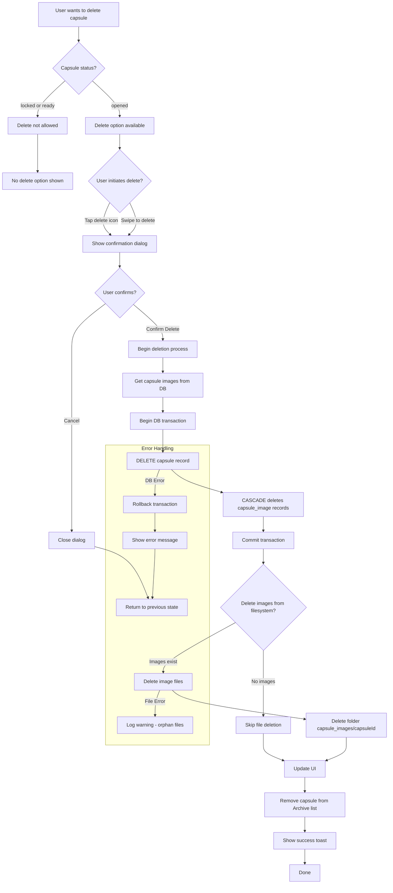
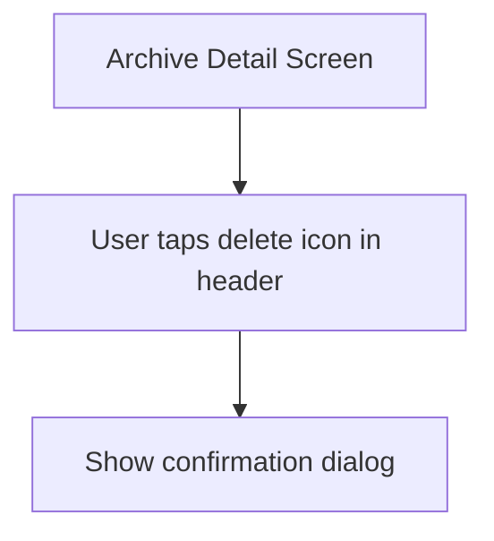
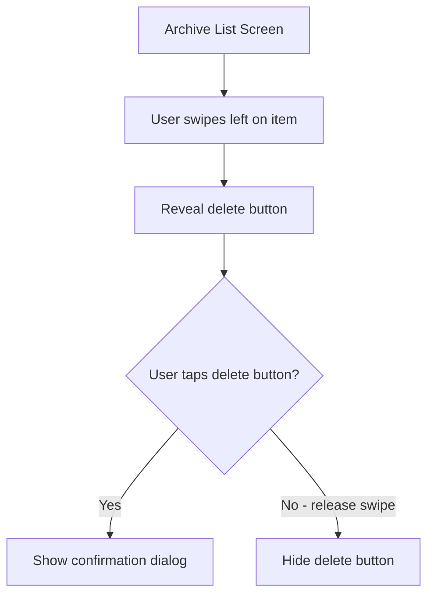
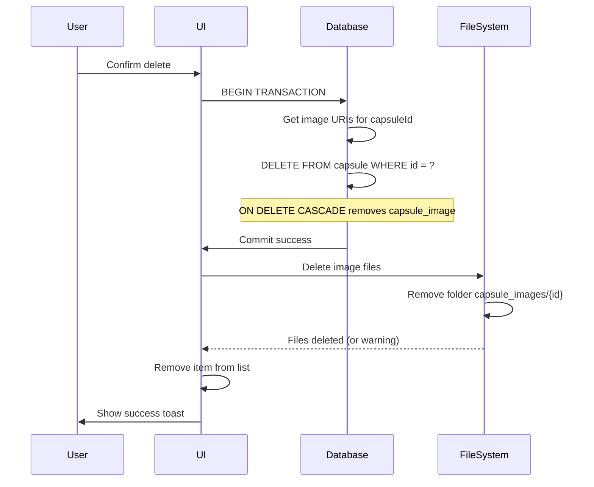
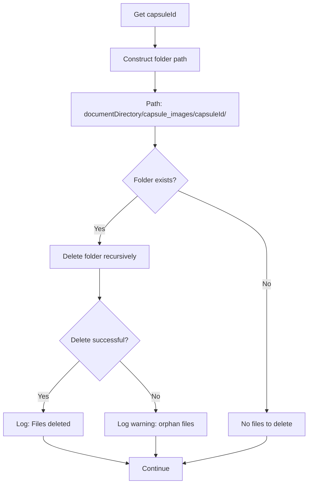
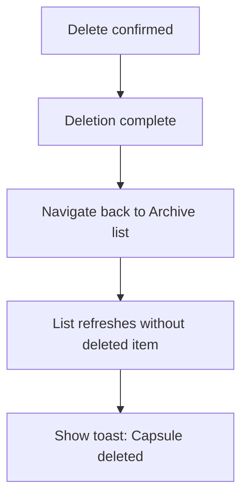
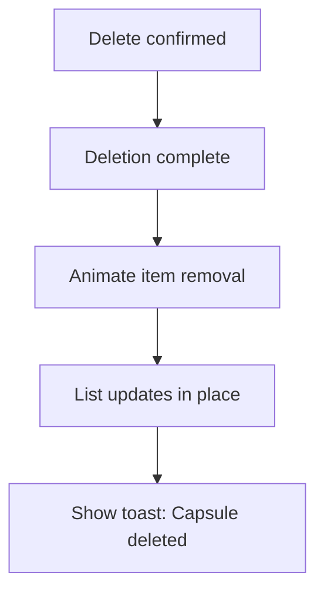

# F12: Delete Opened Capsule - Activity Diagram

**Feature ID:** F12
**Priority:** Should Have
**Dependencies:** F11 (Archive/History)

---

## 1. Overview

Cho phep user xoa capsule da mo (status = opened) khoi Archive. Chi capsule da opened moi co the xoa - capsule locked/ready khong the xoa.

---

## 2. Main Activity Diagram



---

## 3. Delete Initiation Methods

### 3.1 Delete from Detail Screen



### 3.2 Swipe to Delete (Optional)



---

## 4. Confirmation Dialog

```
+----------------------------------+
|                                  |
|     Delete this capsule?         |
|                                  |
|  This action cannot be undone.   |
|  All content and images will     |
|  be permanently deleted.         |
|                                  |
|  +------------+  +------------+  |
|  |   Cancel   |  |   Delete   |  |
|  +------------+  +------------+  |
|                                  |
+----------------------------------+
```

---

## 5. Swipe-to-Delete UI

```
Normal state:
+----------------------------------+
| [Icon] Emotion Capsule           |
| Created: Nov 25, 2024            |
| "Today I felt..."                |
+----------------------------------+

Swiped state:
+----------------------------------+
| [Icon] Emotion Caps... | [DELETE]|
| Created: Nov 25, 2024  |  [Red]  |
| "Today I felt..."      |         |
+----------------------------------+
```

---

## 6. Deletion Process



---

## 7. Delete SQL

```sql
-- Transaction block
BEGIN TRANSACTION;

-- Capsule_image records will be deleted automatically due to ON DELETE CASCADE
DELETE FROM capsule
WHERE id = ? AND status = 'opened';

COMMIT;
```

---

## 8. File Deletion



---

## 9. UI Update After Delete

### 9.1 From Detail Screen



### 9.2 From List (Swipe)



---

## 10. Item Removal Animation

| Animation | Duration | Effect |
|-----------|----------|--------|
| Slide out | 300ms | Item slides to left |
| Collapse | 200ms | Gap collapses |
| Toast appear | 200ms | From bottom |
| Toast disappear | 200ms | Fade out after 2s |

---

## 11. Edge Cases

| Case | Handling |
|------|----------|
| Delete last capsule | Show Empty State after deletion |
| Delete while offline | Works (local database) |
| Delete fails mid-process | Rollback, show error |
| Image file not found | Log warning, continue |
| User spams delete button | Disable after first tap |
| Capsule not found (race) | Show error, refresh list |

---

## 12. Restrictions

| Status | Can Delete? | Reason |
|--------|-------------|--------|
| locked | No | Preserve commitment |
| ready | No | Preserve commitment |
| opened | Yes | User choice to clean up |

---

## 13. Undo (Not Implemented)

v1 does not support undo. Once deleted, data is permanently gone.

Future enhancement could include:
- Soft delete with trash/recovery period
- Export before delete option

---

## 14. Success Toast

```
+----------------------------------------+
|                                        |
|  [Check icon] Capsule deleted          |
|                                        |
+----------------------------------------+
```

Duration: 2 seconds, auto-dismiss.

---

## 15. Error Handling

### 15.1 Database Error

```
+----------------------------------+
|                                  |
|     Failed to delete            |
|                                  |
|  Something went wrong. Please    |
|  try again.                      |
|                                  |
|         +------------+           |
|         |     OK     |           |
|         +------------+           |
|                                  |
+----------------------------------+
```

### 15.2 File Error (Non-blocking)

- Log warning to console
- Continue with success (data is deleted)
- Orphan files may remain (acceptable)

---

## 16. Accessibility

| Element | Accessibility |
|---------|---------------|
| Delete icon | Label: "Delete capsule" |
| Swipe action | Accessible alternative: long press → menu |
| Confirmation dialog | Focus trapped in dialog |
| Cancel button | Label: "Cancel" |
| Delete button | Label: "Delete permanently" |

---

## 17. Haptic Feedback

| Action | Haptic |
|--------|--------|
| Swipe reveal | Light |
| Tap delete button | Light |
| Delete confirmed | Medium (warning) |
| Delete complete | Light |

---

*Flow End*
