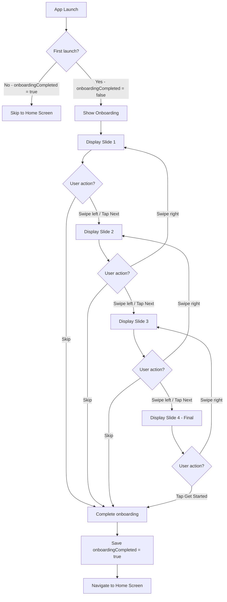
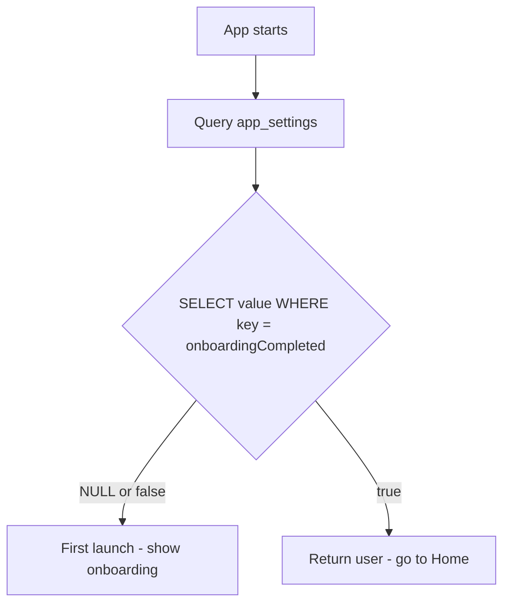
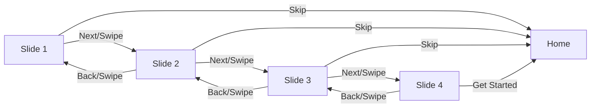
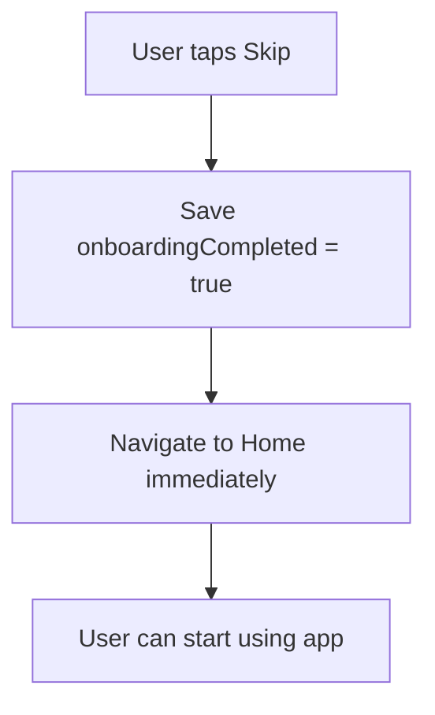
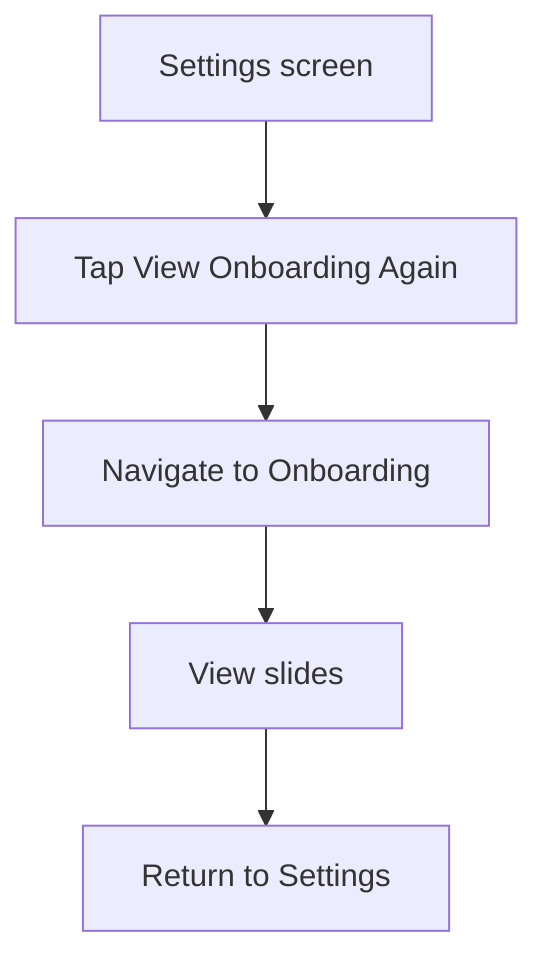

# F13: Onboarding - Activity Diagram

**Feature ID:** F13
**Priority:** Should Have
**Dependencies:** None (Independent)

---

## 1. Overview

Man hinh gioi thieu app cho nguoi dung lan dau mo app. Bao gom 3-4 slides giai thich concept va cac tinh nang chinh cua FutureBoxes.

---

## 2. Main Activity Diagram



---

## 3. First Launch Check



---

## 4. Slide Content

### Slide 1: Welcome / Concept

```
+----------------------------------------+
|                                        |
|        [Time Capsule Illustration]     |
|                                        |
|         Welcome to FutureBoxes         |
|                                        |
|   Send messages to your future self    |
|   and rediscover them when the time    |
|   is right.                            |
|                                        |
|              o . . .                   |  <- Pagination dots
|                                        |
|   [Skip]                    [Next ->]  |
+----------------------------------------+
```

### Slide 2: Capsule Types

```
+----------------------------------------+
|                                        |
|        [4 Capsule Types Icons]         |
|                                        |
|           Four Ways to Reflect         |
|                                        |
|   Emotion - Capture your feelings      |
|   Goal - Track your aspirations        |
|   Memory - Preserve moments            |
|   Decision - Evaluate choices          |
|                                        |
|              . o . .                   |
|                                        |
|   [Skip]                    [Next ->]  |
+----------------------------------------+
```

### Slide 3: Lock & Unlock

```
+----------------------------------------+
|                                        |
|        [Lock/Unlock Animation]         |
|                                        |
|           Lock It Away                 |
|                                        |
|   Your capsule stays sealed until      |
|   the date you choose. No peeking!     |
|   We'll notify you when it's ready.    |
|                                        |
|              . . o .                   |
|                                        |
|   [Skip]                    [Next ->]  |
+----------------------------------------+
```

### Slide 4: Get Started (Final)

```
+----------------------------------------+
|                                        |
|        [Celebration Illustration]      |
|                                        |
|           Ready to Begin?              |
|                                        |
|   Create your first time capsule       |
|   and start your journey of            |
|   self-reflection.                     |
|                                        |
|              . . . o                   |
|                                        |
|        +--------------------+          |
|        |    Get Started     |          |
|        +--------------------+          |
+----------------------------------------+
```

---

## 5. Navigation Within Onboarding



---

## 6. Skip Behavior



Skip is available on all slides except the final one (which has "Get Started" instead).

---

## 7. Pagination Dots

| Slide | Dots Display |
|-------|--------------|
| 1 | o . . . |
| 2 | . o . . |
| 3 | . . o . |
| 4 | . . . o |

---

## 8. Swipe Gestures

| Gesture | Action |
|---------|--------|
| Swipe left | Go to next slide |
| Swipe right | Go to previous slide |
| Tap Next button | Go to next slide |
| Tap Skip | Complete onboarding |
| Tap Get Started (final) | Complete onboarding |

---

## 9. Animation Specifications

### 9.1 Slide Transition

| Animation | Duration | Easing |
|-----------|----------|--------|
| Slide out | 300ms | ease-in-out |
| Slide in | 300ms | ease-in-out |
| Cross-fade (alternative) | 400ms | ease-out |

### 9.2 Illustration Animations

| Slide | Animation |
|-------|-----------|
| Slide 1 | Capsule floating gently |
| Slide 2 | Icons appearing sequentially |
| Slide 3 | Lock closing, then opening |
| Slide 4 | Confetti or sparkles |

---

## 10. Illustrations

| Slide | Illustration Concept |
|-------|---------------------|
| 1 | Time capsule box with sparkles |
| 2 | Four capsule type icons in grid |
| 3 | Lock with countdown timer |
| 4 | Open capsule with light rays |

Note: Can use Lottie animations or static SVG illustrations.

---

## 11. Persistence

```sql
-- Mark onboarding complete
INSERT OR REPLACE INTO app_settings (key, value, updatedAt)
VALUES ('onboardingCompleted', 'true', strftime('%s', 'now'));
```

---

## 12. Re-view Onboarding (Future)

Not implemented in v1. Future enhancement:



---

## 13. Edge Cases

| Case | Handling |
|------|----------|
| App killed during onboarding | Resume from beginning |
| Skip on first slide | Complete immediately |
| Swipe right on first slide | No action (already first) |
| Swipe left on last slide | No action (already last) |
| Fast swipes | Debounce to prevent skipping slides |
| Rotate device | Maintain current slide |

---

## 14. Performance

| Consideration | Implementation |
|---------------|----------------|
| Illustrations | Preload all during splash |
| Animations | Keep simple for smooth transitions |
| Memory | Unload off-screen slides |

---

## 15. Accessibility

| Element | Accessibility |
|---------|---------------|
| Slide content | Full text readable |
| Illustrations | Decorative (aria-hidden) |
| Next button | Label: "Go to next slide" |
| Skip button | Label: "Skip onboarding" |
| Get Started | Label: "Start using the app" |
| Pagination | Current slide X of 4 |

---

## 16. Screen Reader Flow

```
Slide 1:
"Welcome to FutureBoxes.
Send messages to your future self and rediscover them when the time is right.
Slide 1 of 4.
Skip button. Next button."

[User taps Next]

Slide 2:
"Four Ways to Reflect.
Emotion - Capture your feelings.
Goal - Track your aspirations.
Memory - Preserve moments.
Decision - Evaluate choices.
Slide 2 of 4.
Skip button. Next button."

...and so on
```

---

## 17. Design Tokens

| Token | Value | Usage |
|-------|-------|-------|
| Background | Primary gradient or white | Slide background |
| Title | Heading 1 | Slide title |
| Body text | Body 1 | Slide description |
| Skip button | Text button, secondary | Skip action |
| Next button | Contained button, primary | Navigation |
| Get Started | Contained button, primary | Final CTA |
| Dot active | Primary color | Current slide |
| Dot inactive | Gray 300 | Other slides |

---

*Flow End*
