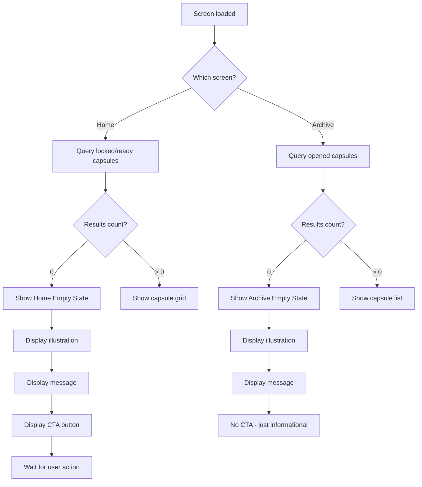
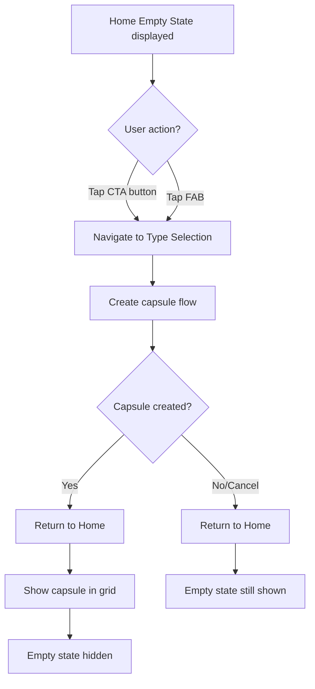
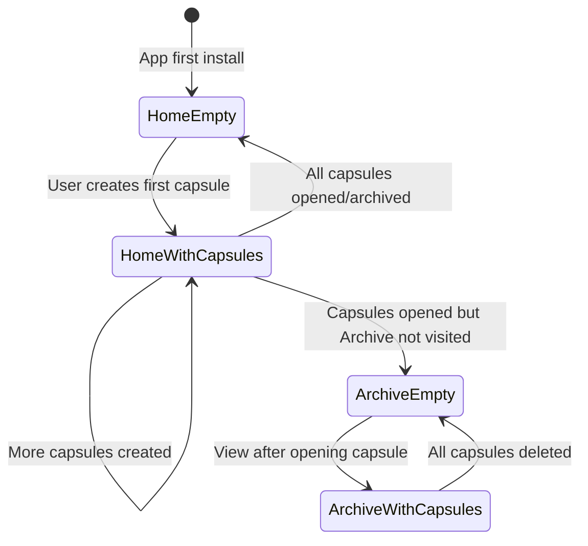

# F14: Empty States - Activity Diagram

**Feature ID:** F14
**Priority:** Should Have
**Dependencies:** F2 (Home Screen), F11 (Archive/History)

---

## 1. Overview

Hien thi UI than thien khi khong co capsules de huong dan user thuc hien action tiep theo. Ap dung cho Home Screen (khong co capsule locked/ready) va Archive (khong co capsule opened).

---

## 2. Main Activity Diagram



---

## 3. Home Empty State

### 3.1 Display

```
+----------------------------------------+
|  FutureBoxes                [Archive]  |
+----------------------------------------+
|                                        |
|                                        |
|                                        |
|        [Empty Box Illustration]        |
|                                        |
|                                        |
|       No time capsules yet             |
|                                        |
|    Create your first capsule to        |
|    send a message to your future       |
|    self!                               |
|                                        |
|                                        |
|     +----------------------------+     |
|     |   Create First Capsule     |     |
|     +----------------------------+     |
|                                        |
|                                        |
|                              [+]       |  <- FAB still visible
+----------------------------------------+
```

### 3.2 User Interaction



---

## 4. Archive Empty State

### 4.1 Display

```
+----------------------------------------+
|  <- Back            Archive            |
+----------------------------------------+
|                                        |
|                                        |
|                                        |
|        [Empty Folder Illustration]     |
|                                        |
|                                        |
|     No opened capsules yet             |
|                                        |
|    Your opened capsules will           |
|    appear here. Create a capsule       |
|    and wait for it to unlock!          |
|                                        |
|                                        |
|                                        |
|                                        |
+----------------------------------------+
```

### 4.2 No CTA for Archive

Archive empty state is informational only because:
- User cannot directly create an "opened" capsule
- They need to wait for locked capsules to unlock
- The process is: Create -> Lock -> Wait -> Open -> Archive

---

## 5. Illustration Specifications

### 5.1 Home Empty State

| Element | Description |
|---------|-------------|
| Main element | Empty/open time capsule box |
| Style | Friendly, inviting, not sad |
| Colors | Primary palette, light background |
| Animation (optional) | Subtle floating or glow |

### 5.2 Archive Empty State

| Element | Description |
|---------|-------------|
| Main element | Empty folder or box with stars |
| Style | Hopeful, anticipating |
| Colors | Muted but warm |
| Animation (optional) | Gentle pulse |

---

## 6. Text Content

### 6.1 Home Empty State

| Element | Content |
|---------|---------|
| Title | "No time capsules yet" |
| Description | "Create your first capsule to send a message to your future self!" |
| CTA | "Create First Capsule" |

### 6.2 Archive Empty State

| Element | Content |
|---------|---------|
| Title | "No opened capsules yet" |
| Description | "Your opened capsules will appear here. Create a capsule and wait for it to unlock!" |
| CTA | None |

---

## 7. State Transitions



---

## 8. Edge Cases

| Case | Handling |
|------|----------|
| Home: All capsules are opened | Show empty state (opened capsules not in Home) |
| Archive: All capsules deleted | Show empty state |
| Transition from content to empty | Animate out list, fade in empty state |
| Quick create and delete | Handle race conditions gracefully |

---

## 9. Responsive Layout

### 9.1 Small Screen

```
+------------------------+
|                        |
|    [Illustration]      |
|                        |
|   No capsules yet      |
|                        |
|   Create your first    |
|   capsule...           |
|                        |
|   [Create Capsule]     |
|                        |
+------------------------+
```

### 9.2 Large Screen / Tablet

```
+----------------------------------------+
|                                        |
|                                        |
|            [Illustration]              |
|                                        |
|        No time capsules yet            |
|                                        |
|    Create your first capsule to        |
|    send a message to your future       |
|    self!                               |
|                                        |
|        [Create First Capsule]          |
|                                        |
|                                        |
+----------------------------------------+
```

---

## 10. Animation

### 10.1 Empty State Appear

| Animation | Duration | Easing |
|-----------|----------|--------|
| Illustration fade in | 400ms | ease-out |
| Text fade in | 300ms, delay 200ms | ease-out |
| CTA button fade in | 300ms, delay 400ms | ease-out |

### 10.2 Empty State Disappear

| Animation | Duration | Easing |
|-----------|----------|--------|
| All elements fade out | 200ms | ease-in |
| Content fades in | 300ms | ease-out |

---

## 11. Accessibility

| Element | Accessibility |
|---------|---------------|
| Illustration | Decorative (aria-hidden) |
| Title | Heading level 2 |
| Description | Body text, readable |
| CTA button | Label: "Create your first capsule" |

---

## 12. Design Tokens

| Token | Usage |
|-------|-------|
| Illustration size | 150-200px |
| Title | Heading 2, centered |
| Description | Body 1, centered, muted color |
| CTA button | Primary, medium size |
| Container | Centered, max-width 300px |
| Vertical spacing | 24px between elements |

---

## 13. Illustration Options

### 13.1 Static Illustrations

- SVG illustrations from design library
- Custom designed for app brand
- Light/dark mode variants

### 13.2 Lottie Animations

- Subtle movement (floating, pulsing)
- Looping, performance-friendly
- Can be disabled for accessibility

### 13.3 Simple Icons (Fallback)

- Large icon from icon library
- With decorative elements
- For MVP or low-resource devices

---

## 14. Conditional Rendering Logic

```typescript
// Home Screen
function HomeScreen() {
  const { capsules, isLoading } = useCapsules({ status: ['locked', 'ready'] });

  if (isLoading) return <Loading />;

  if (capsules.length === 0) {
    return <HomeEmptyState onCreatePress={navigateToCreate} />;
  }

  return <CapsuleGrid capsules={capsules} />;
}

// Archive Screen
function ArchiveScreen() {
  const { capsules, isLoading } = useCapsules({ status: 'opened' });

  if (isLoading) return <Loading />;

  if (capsules.length === 0) {
    return <ArchiveEmptyState />;
  }

  return <CapsuleList capsules={capsules} />;
}
```

---

## 15. Testing Scenarios

| Scenario | Expected Result |
|----------|-----------------|
| Fresh install | Home shows empty state |
| Create first capsule | Empty state replaced by grid |
| Delete all opened capsules | Archive shows empty state |
| Open last ready capsule | Home shows empty state |

---

*Flow End*
